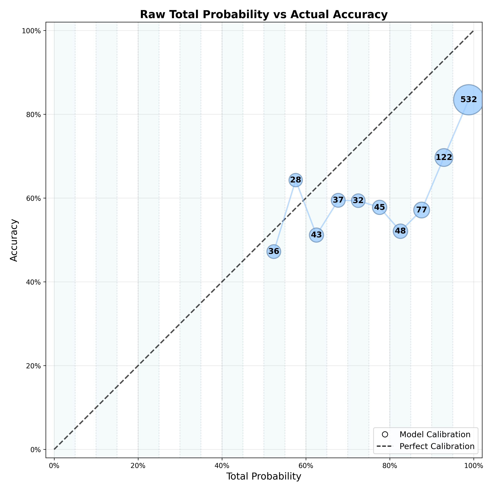
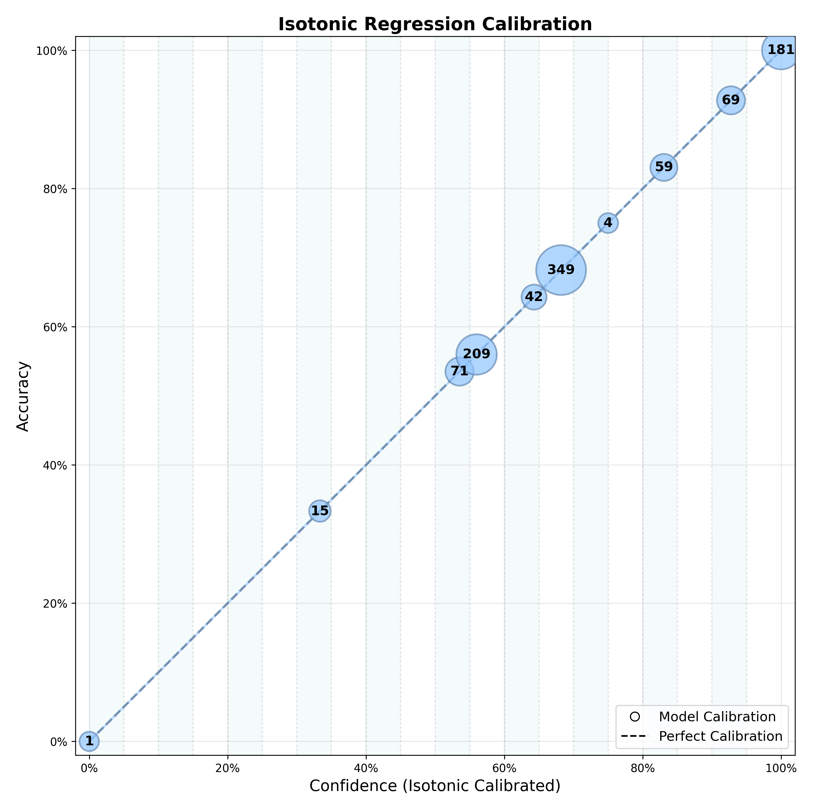
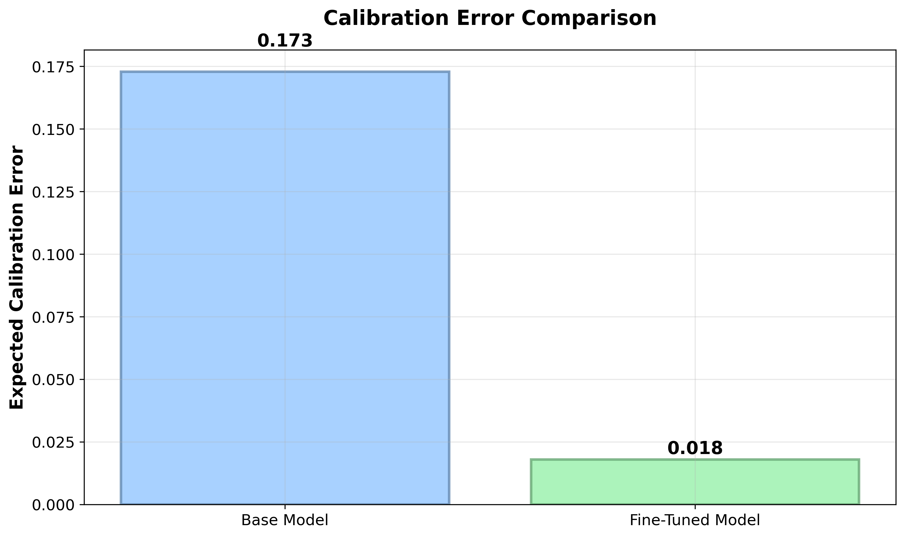
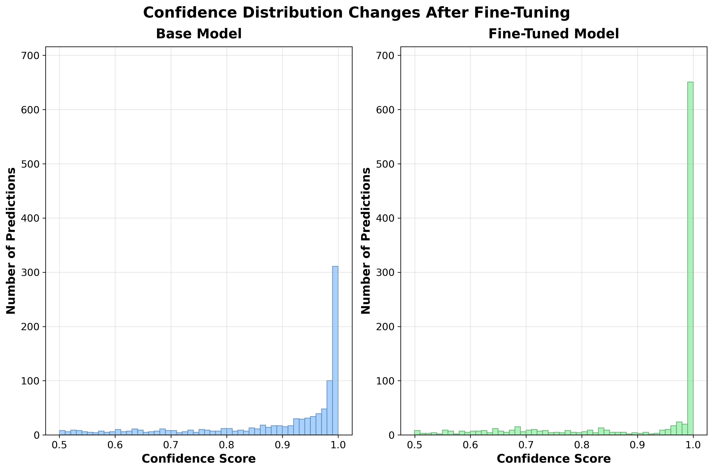
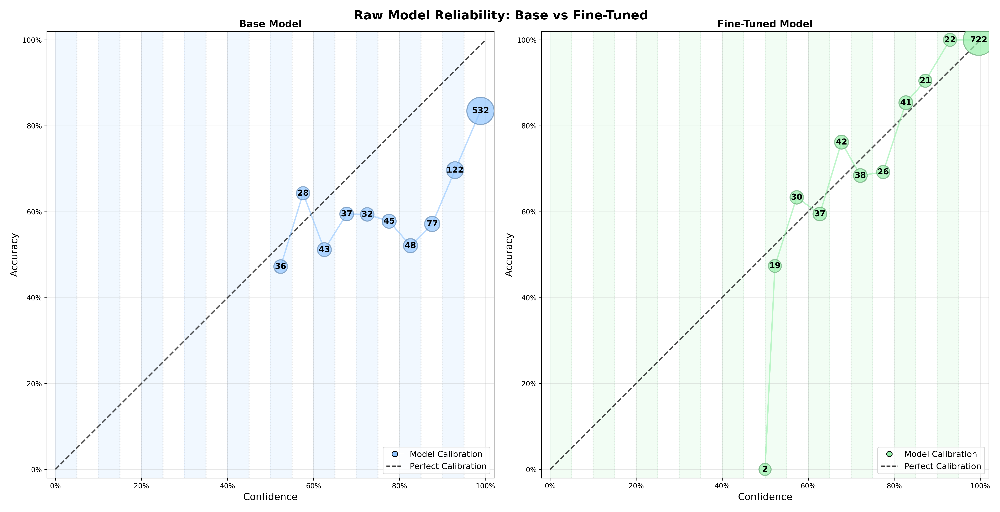
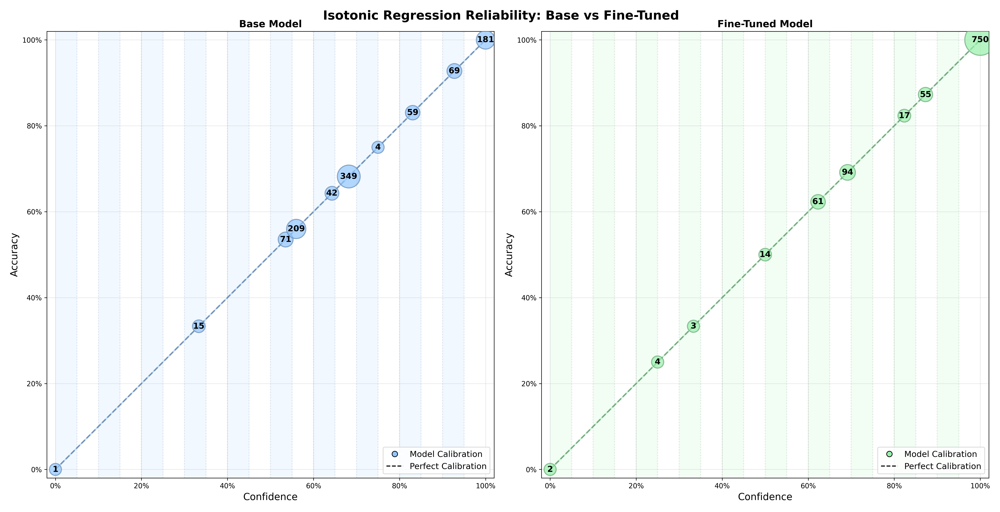

# Getting Confidence Scores from Language Model Classifications

> **TL;DR**: Language models are prediction machines that calculate probabilities for what comes next. We can extract these internal probabilities to get genuine confidence scores that transform "I think it's positive" into "I'm 87% confident it's positive."

## Understanding How Language Models Actually Work

If I say to you **"Knock knock"**, what are you probably going to say back to me?

You'll probably say **"Who's there?"**, right?

This is exactly how language models work. They're prediction machines that learn common patterns in language. Most patterns are far more complex than the knock-knock joke setup pattern (which is why these models are so huge), but the fundamental mechanism is identical: predict the most likely next word based on what came before.

When language models "generate" text, they're actually **predicting** text in exactly that same way. They see the input—like "Knock knock"—and then they predict: *What is the most likely next word?*

Let's see this in action using Meta's Llama 3.1-8B-Instruct model. Here's what happens when we give it the raw prompt "Knock knock.":

**RAW PROMPT:** "Knock knock."

**NEXT TOKEN PREDICTIONS:**

| Rank | Token | Log-Prob | Probability | Percentage |
|------|-------|----------|-------------|------------|
| 1. | "Who " | -0.277 | 0.757720 | 75.77% |
| 2. | "It " | -4.106 | 0.016481 | 1.65% |
| 3. | " " | -4.246 | 0.014319 | 1.43% |
| 4. | "" " | -4.582 | 0.010233 | 1.02% |
| 5. | "I " | -4.582 | 0.010233 | 1.02% |
| 6. | "The " | -4.652 | 0.009538 | 0.95% |
| 7. | "( " | -5.074 | 0.006255 | 0.63% |
| 8. | "This " | -5.129 | 0.005922 | 0.59% |
| 9. | "A " | -5.293 | 0.005026 | 0.50% |
| 10. | "Wh " | -5.449 | 0.004299 | 0.43% |
| 11. | "What " | -5.465 | 0.004233 | 0.42% |
| 12. | "Is " | -5.793 | 0.003049 | 0.30% |

**The model selected: "Who" (75.77% probability)**

The model learned the same pattern you know: "Knock knock" is almost always followed by "Who's there?" It predicts "Who" with 75.77% confidence because that's what it learned from millions of examples in its training data.

*(**What's a Logarithmic Probability?** It's the raw score the model uses internally to track probabilities, often shortened to "log-prob." We convert these scores into simple percentages to make them easy to understand.)*

## Using Language Models as Classifiers

Language models can do a lot of neat stuff other than write poetry.
One of the things you can do with them is classification: Sorting things into buckets, like positive sentiment versus negative sentiment.

If you set up your prompt as a classification task then you can use this prediction mechanism to turn the langauge model into a classifier.  The model generates sub-word parts called "tokens", and you set it up so that the first token that the language model predicts is the classification. 

### Sentiment Classification: The Same Prediction Process

Let's say we want to classify the sentiment of "I love this movie!" We can construct it so that the first token represents the answer prediction.  Since "positive" and "negative" are words with a lot of syllables that will be ended as multiple tokens, we don't ask the model for those words.  We set it up so that the model responds with "yes" or "no", so that each of our classification classes is represented by a single token.

```
INPUT PROMPT: "Is this text positive in sentiment? Answer yes or no.

Text: "I love this movie!"
```

Now the model has to predict what comes next. Just like with "Knock knock" → "Who", Llama will predict the most likely response. Let's see what actually happens when we run this prompt through Llama:

**INPUT PROMPT:** "Is this text positive in sentiment? Answer yes or no.

Text: "I love this movie!"

**FIRST TOKEN PREDICTIONS:**

| Rank | Token | Log-Prob | Probability | Percentage |
|------|-------|----------|-------------|------------|
| 1. | "Yes " | -0.429 | 0.651236 | 65.12% |
| 2. | "yes " | -1.054 | 0.348581 | 34.86% |
| 3. | "YES " | -8.945 | 0.000130 | 0.01% |
| 4. | "No " | -10.476 | 0.000028 | 0.00% |
| 5. | "no " | -11.210 | 0.000014 | 0.00% |
| 6. | "Y " | -15.038 | 0.000000 | 0.00% |
| 7. | "y " | -15.726 | 0.000000 | 0.00% |
| 8. | "True " | -17.601 | 0.000000 | 0.00% |
| 9. | "NO " | -17.820 | 0.000000 | 0.00% |
| 10. | "true " | -18.148 | 0.000000 | 0.00% |
| 11. | "Positive" | -18.859 | 0.000000 | 0.00% |
| 12. | "1 " | -19.710 | 0.000000 | 0.00% |

**The model selected: "Yes" (65.12% probability)**

The Llama model predicts that "I love this movie!" will almost always be considered positive, and so it predicts a token consistent with that. It predicts "Yes" variants with overwhelming confidence:

- **All "YES" variants** (Yes, yes, YES, y, Y): **99.99%**
- **All "NO" variants** (No, no, NO, n, N): **0.01%**

**Final Classification: POSITIVE (99.99% confidence)**

This is the same prediction mechanism as "Knock knock" → "Who", but now we're using it for classification.

### Low Confidence Example: When the Model is Uncertain

But what happens when we give the model genuinely ambiguous text? Let's try something confusing:

**INPUT PROMPT:** "Is this text positive in sentiment? Answer yes or no.

Text: "Best worst thing ever"

**FIRST TOKEN PREDICTIONS:**

| Rank | Token | Log-Prob | Probability | Percentage |
|------|-------|----------|-------------|------------|
| 1. | "Yes " | -1.005 | 0.366004 | 36.60% |
| 2. | "No " | -1.318 | 0.267774 | 26.78% |
| 3. | "no " | -1.568 | 0.208543 | 20.85% |
| 4. | "yes " | -1.865 | 0.154976 | 15.50% |
| 5. | "YES " | -9.161 | 0.000105 | 0.01% |
| 6. | "NO " | -9.177 | 0.000103 | 0.01% |
| 7. | "Positive" | -12.029 | 0.000006 | 0.00% |
| 8. | "Negative" | -12.122 | 0.000005 | 0.00% |
| 9. | "N " | -12.255 | 0.000005 | 0.00% |
| 10. | "Y " | -12.685 | 0.000003 | 0.00% |
| 11. | "y " | -12.857 | 0.000003 | 0.00% |
| 12. | "True " | -13.568 | 0.000001 | 0.00% |

**The model selected: "Yes" (36.60% probability)**

Look at the difference in the probabilities on the predictions.  The model is giving us a prediction, but it's also clearly communicating that it's not certain:

- **All "YES" variants**: **52.11%**
- **All "NO" variants**: **47.64%**

The "YES" variants add up to about 52% probability, and the "NO" variants are below 47%.

This is basically a coin flip. The contradictory words "Best worst" are confusing, and the probabilities on the predictions tell us that

Those probabilities represent our confidence in the predictions. When the model predicts "Yes" with 99.99% confidence versus 52% confidence, it's showing us its internal uncertainty. This isn't just a guess—it's a mathematically grounded probability based on learned patterns.

## The Algorithm: Computing Total Probability

Let's walk through the algorithm step by step using a new example with medium confidence.

Let's try a phrase with mixed signals:

**INPUT PROMPT:** "Is this text positive in sentiment? Answer yes or no.

Text: "Not bad"

**FIRST TOKEN PREDICTIONS:**

| Rank | Token | Log-Prob | Probability | Percentage |
|------|-------|----------|-------------|------------|
| 1. | "yes " | -0.899 | 0.406781 | 40.68% |
| 2. | "Yes " | -0.978 | 0.376211 | 37.62% |
| 3. | "no " | -1.993 | 0.136255 | 13.63% |
| 4. | "No " | -2.524 | 0.080100 | 8.01% |
| 5. | "YES " | -9.618 | 0.000067 | 0.01% |
| 6. | "NO " | -11.103 | 0.000015 | 0.00% |
| 7. | "y " | -13.243 | 0.000002 | 0.00% |
| 8. | "Y " | -13.798 | 0.000001 | 0.00% |
| 9. | "N " | -13.868 | 0.000001 | 0.00% |
| 10. | "Positive" | -14.212 | 0.000001 | 0.00% |
| 11. | "true " | -14.540 | 0.000000 | 0.00% |
| 12. | "True " | -14.595 | 0.000000 | 0.00% |

Now here's the step-by-step algorithm:

### Step 1: Identify the Most Likely Token
The model selected **"yes"** (40.68% probability) as its top prediction.

### Step 2: Determine the Classification Class
**"yes"** indicates **POSITIVE** sentiment.

### Step 3: Find All Tokens Supporting This Class
Look through all predicted tokens and find every one that supports POSITIVE:
- "yes" (40.68%)
- "Yes" (37.62%) 
- "YES" (0.01%)
- "y" (0.00%)
- "Y" (0.00%)

### Step 4: Calculate Total Probability
Add up all the probabilities for POSITIVE tokens:
**Total Probability = 40.68% + 37.62% + 0.01% + 0.00% + 0.00% = 78.31%**

### Step 5: Final Classification
- **Prediction**: POSITIVE (because "yes" was the top token)
- **Confidence**: 78.31% (the total probability of all POSITIVE tokens)

This **total probability** becomes our confidence score. It represents how much of the model's probability mass supports the predicted classification class.

## From Predictions to Confidence Scores

But do those numbers mean what they think they mean?  If the model says that it's 99% confident that it has the right answer, then will the answer really be right 99% of the time?

Let's do some analysis to learn more about that.

### Testing Our New Technique on Real Data

Now we have this powerful technique for extracting **total probability scores** from language models. But what do these numbers actually look like in practice?

To find out, we created a comprehensive [dataset of 10,000 sentiment examples](dataset/), carefully organized into eight distinct categories:

**Strongly Obvious Examples:**
- **Strong Positive**: Clear positive sentiment like "I absolutely love this!"
- **Strong Negative**: Clear negative sentiment like "This is terrible!"

**Moderately Clear Examples:**
- **Medium Positive**: Moderately positive like "This is pretty good"
- **Medium Negative**: Moderately negative like "This isn't great"

**Subtle Examples:**
- **Weak Positive**: Subtle positive signals like "It's okay I guess"
- **Weak Negative**: Subtle negative signals like "Could be better"

**Neutral Examples:**
- **Neutral Positive**: Completely neutral statements labeled as positive
- **Neutral Negative**: Completely neutral statements labeled as negative

This variety was intentional—we wanted to create examples that would produce a wide range of total probability scores, from crystal-clear cases where Llama would be very certain, to genuinely ambiguous cases where it would be uncertain.

When we ran our total probability algorithm on 1,000 random samples from this dataset using Llama 3.1-8B, here's what we discovered:


*Total probability scores from 1,000 sentiment classification predictions*

**What's happening here:**

The model gives us a wide range of confidence levels. Some predictions get very high total probability scores (80-100%) when the text is crystal clear. Others get much lower scores (50-70%) when the language is ambiguous or contradictory.

Notice how the model rarely sits on the fence—it tends to be either fairly confident or quite uncertain, with fewer predictions landing in the middle ranges.

## Do These Numbers Actually Mean What We Think They Mean?

But we still don't know for sure what the numbers mean.

To find out, we need to test our total probability scores against reality. We can't just trust the numbers—we need to measure how accurate they actually are.

Here's how we do it: We take our 1,000 test examples (each with a human-labeled "truth" about whether it's positive or negative sentiment) and run them through our model. For each prediction, we record two things:

1. **The total probability score** our algorithm calculated
2. **Whether the prediction was correct** according to the human label

Now comes the key insight: We can group predictions by their total probability scores and see what the actual accuracy was for each group.

### How We Check if Confidence Scores are Accurate

Let's look at what happens when we organize our results this way:



This chart tells a fascinating story. Here's how to read it:

**The Vertical Stripes:** Each stripe represents a 5% range of total probability scores. For example, one stripe covers all predictions that scored between 95-100%, another covers 90-95%, and so on down to 50-55%.

**The Dots:** Each dot shows the actual accuracy for predictions in that range. The size of each dot represents how many predictions fell into that bucket.

**The Big Dot (532):** Look at the largest dot in the upper right. This represents 532 predictions that our model gave total probability scores between 95-100%. But notice where the dot sits vertically—it's at about 85% actual accuracy, not 95-100%!

**The Perfect Calibration Line:** The diagonal dashed line shows where dots would sit if total probability scores perfectly matched actual accuracy. If our model were perfectly calibrated, all dots would sit exactly on this line.

### The Good News and The Problem

**The Good News:** Our total probability scores do correlate with actual accuracy! Higher scores generally mean higher accuracy, and lower scores mean lower accuracy. The model is genuinely measuring something meaningful about its own uncertainty.

**The Problem:** The scores are systematically overconfident. When the model says it's 95% sure, it's actually only right about 85% of the time. When it says 80%, it might only be right 70% of the time.

This gap between predicted confidence and actual accuracy is exactly what we mean by **calibration error**. The model's internal probability calculations are useful, but they need to be adjusted to reflect reality.

### From Total Probability to True Confidence

This is where calibration comes in. We can fix that.  We can take these raw total probability scores and mathematically adjust them to better match actual accuracy rates. Once we do this calibration, we can finally call them true **confidence scores**.

Here's what happens when we apply two different calibration methods:

**Platt Scaling Calibration:**


**Isotonic Regression Calibration:**


Notice how the calibrated versions get much closer to that perfect diagonal line. The dots now sit much closer to where they should be if confidence scores truly reflected accuracy rates.

### Understanding Confidence Scores Below 50%

**You might notice something surprising in the calibrated charts:** Some dots appear below the 50% confidence line. This might seem confusing at first—how can a model be "confident" that something is positive sentiment with only 30% confidence?  How could you be less than 50% confident in guessing the outcome of a coin flip?

**Here's what's actually happening:**

When we calculated the original "total probability" scores, we were looking at raw probabilities like 65% for positive sentiment. In a binary classification, this means 35% for negative sentiment, so the model was leaning positive.

**But calibration revealed the truth:** When the model gives a raw 65% total probability, it's historically only been correct about 30% of the time. So the calibrated confidence score becomes 30%.

**What does 30% confidence for "positive" actually mean?**
- The model's *prediction* is still "positive" (because 65% > 50% in the raw probabilities)
- But the *confidence* in that prediction is only 30% (because calibration showed 65% raw probability historically means 30% accuracy)
- **In business terms:** This prediction should definitely go to human review—the model is essentially saying "I have to pick positive, but I'm really not sure"

**This is actually valuable information!** These low-confidence predictions (whether 30% confident in "positive" or 30% confident in "negative") are exactly the ones that need human attention. The calibration process is honestly telling you: "The model made a prediction, but based on historical performance, you shouldn't trust it."

**Key insight:** Calibration doesn't change what the model predicts—it changes how much you should trust those predictions. A 30% confident "positive" prediction is still a "positive" prediction, but it's one you should handle very carefully.

**This is the transformation from raw total probability to genuine confidence.** Now we can trust the numbers! 

Let's look at what this means with our actual data. In the Platt scaling chart, you can see there are 181 predictions with calibrated confidence scores above 95%. Because we've calibrated the model, we know these will actually be correct at least 95% of the time—and in fact, looking at the chart, they're essentially 100% accurate.

Want predictions that are at least 90% accurate? Look at the 90-95% range (69 predictions) plus the 95-100% range (181 predictions). That's 250 total predictions where we can confidently say: "These will be right at least 90% of the time."

**This is the magic of calibration!** Before calibration, a "90% total probability" was just a number that hopefully meant something about accuracy. After calibration, a "90% confidence score" becomes a reliable guarantee: we can trust that predictions at this level really will be accurate 90% of the time.

## Using Confidence Scores for Business Decisions

Now that we have reliable confidence scores, how do we actually use them? The key insight is that **confidence thresholds give you control over the automation vs. human review trade-off.**

### The Core Business Decision: Where to Set Your Confidence Threshold

You need to decide which predictions you can trust enough to automated, and which you should send to humans for review.  But the more that you send to humans for review, the more it costs you.  Both in terms of direct costs and in terms of complexity and process delays.

The confidence threshold is your control knob for this decision. Set it high, and you'll only automate the predictions you're very sure about—but you'll send more to expensive human review. Set it low, and you'll automate more predictions—but risk more errors.

### The Confidence Threshold Trade-off


This chart shows the fundamental trade-off you need to understand: **"As I change my confidence threshold, how many predictions can I automate, and how accurate will they be?"**

**How to read this chart:**
- **X-axis**: Confidence threshold (50% to 95%)
- **Red line (left Y-axis)**: Accuracy percentage of predictions above each threshold
- **Blue bars (right Y-axis)**: Number of predictions above each threshold
- **Numbers on bars**: Exact prediction counts you get at each threshold
- **Numbers on line**: Exact accuracy percentages at each threshold

### What This Means for Your Business

**The fundamental insight:** You have direct control over how many predictions you automate by adjusting your confidence threshold.

**At 95% confidence threshold:**
- You get 532 predictions (53% of total) that you can automate
- These automated predictions will be correct 83.5% of the time
- The remaining 468 predictions (47%) need human review

**At 80% confidence threshold:**
- You get 779 predictions (78% of total) that you can automate
- These automated predictions will be correct 76.8% of the time
- Only 221 predictions (22%) need human review

**At 60% confidence threshold:**
- You can automate 936 predictions (94% of total)
- These will be correct 73.4% of the time
- Only 64 predictions (6%) need human review

### The Economics: Automation vs. Review Costs

Here's how this translates to real business value:

**Cost Structure:** If human review costs $5 per prediction, processing 1,000 predictions daily:

- **95% threshold**: Automate 532, review 468 → **$2,340/day in review costs**
- **80% threshold**: Automate 779, review 221 → **$1,105/day in review costs**
- **60% threshold**: Automate 936, review 64 → **$320/day in review costs**

**The trade-off:** Lower thresholds save money on human review but increase error rates. Higher thresholds cost more for human review but give you higher accuracy on automated decisions.

**Your optimal threshold depends on:**
- Cost of human review vs. cost of errors
- Risk tolerance in your application
- Volume requirements for automation

### Why Calibrated Confidence Enables Business Value

The real business value comes from having **calibrated confidence scores you can trust**. Here's why:

**Without calibration:** Your model might say it's "90% confident" but historically only be right 70% of the time. You can't trust these scores for automation decisions.

**With calibration:** When your model says it's "90% confident," you know it really will be right 90% of the time. Now you can make reliable automation decisions.

**The business impact:** Calibrated confidence lets you:
- **Set automation thresholds with confidence** - You know exactly what accuracy to expect
- **Control your cost structure** - Adjust thresholds to balance automation savings vs. error costs
- **Scale operations efficiently** - Automate the predictions you can trust, focus human effort where it's needed

This is why confidence calibration can have direct bottom-line impact. The more predictions you can confidently automate based on reliable confidence scores, the lower your operational costs and the faster your processes.

## Uncertainty Quantification

The process of extracting and calibrating these internal probabilities is part of a broader field called **[uncertainty quantification](#uncertainty-quantification)** (UQ)—the science of characterizing and estimating uncertainties in computational systems. In our case, we're quantifying the uncertainty in language model predictions to make them more reliable for business decisions.

## Important Limitations: When This Technique Works

Before you get too excited, there's an important caveat: **this technique requires access to logarithmic probabilities, which isn't always available.**

While virtually all transformer-based language models work by predicting tokens with probabilities (that's just how they're built), you can't always access those probabilities as a user:

**Models That Don't Expose Logarithmic Probabilities:**
- **Reasoning models** (like OpenAI's o1 series) often don't provide logarithmic probabilities
- **Some newer models** (like GPT-5) may not offer this access
- **Certain providers** (like Anthropic with Claude) deliberately don't expose logarithmic probabilities to prevent model distillation and unauthorized cloning

**Models and Providers That Do Work:**
- **OpenAI**: Many models provide logarithmic probabilities (though not all—check their documentation)
- **Local models**: Running models locally through Hugging Face Transformers (like we do here) gives you full access to internal probabilities
- **Many other providers**: Numerous options exist if confidence scoring is important for your use case

**Bottom Line:** If confidence scoring is crucial for your application, you'll need to specifically choose a model and provider that exposes logarithmic probabilities. The good news is that many excellent options exist, especially when running models locally.

## How Much Data Do You Need for Reliable Calibration?

Now that you understand how confidence calibration works, you might be wondering: **"How many examples do I need to get reliable confidence scores?"**

This is a crucial question because calibration quality directly depends on having enough data to learn the relationship between your model's raw probabilities and actual accuracy.

### The Sample Size Effect


This visualization shows how the number of high-confidence predictions changes as you evaluate more examples at different confidence thresholds. Each subplot represents a different confidence threshold (70%, 80%, 90%, 95%):

**What you can see:**
- **50-200 samples**: Very few high-confidence predictions available for automation
- **500 samples**: Moderate number of predictions you can trust at each threshold
- **1000 samples**: Maximum volume showing the true potential of your model

**The key insight**: With more evaluation data, you get a clearer picture of how many predictions you can actually automate at each confidence level. The accuracy percentages (shown above each bar) also stabilize as you use more samples.

### Why More Data Matters

**Statistical Reliability**: With fewer samples, your calibration curve is based on limited evidence. A few unusual examples can throw off the entire calibration, leading to unreliable confidence scores.

**Coverage of Confidence Ranges**: Your model produces predictions across the full confidence spectrum (50% to 100%). With only 50 samples, you might have just 2-3 examples in the crucial 95-100% range. With 1000+ samples, you have dozens of examples in each confidence bucket.

**Business Impact**: Poor calibration from insufficient data means your confidence thresholds become unreliable. A threshold that should give you 90% accuracy might actually give you 70% accuracy, undermining your automated decision-making.

### Practical Recommendations

**Minimum for Production**: Aim for at least **500-1000 labeled examples** for calibration. This gives you enough data points across different confidence ranges to build reliable calibration curves.

**Optimal Range**: **1000+ examples** typically provide excellent calibration quality with diminishing returns beyond that point for most applications.

**Quality Over Quantity**: It's better to have 500 high-quality, representative examples than 2000 examples that don't reflect your real-world data distribution.

**Iterative Improvement**: Start with what you have, measure your calibration quality, and gradually collect more labeled data to improve your confidence scores over time.

The key insight: **reliable confidence scores require investment in labeled data**, but the payoff in automated decision-making capability can be substantial.

## Fine-Tuning: Improving Model Performance on Your Specific Data

While base language models like Llama 3.1-8B are powerful, they have general knowledge that may not perfectly align with your specific data and business requirements. Fine-tuning allows you to train the model on your particular domain, helping it learn patterns specific to your use case.

From a business perspective, fine-tuning can shift more predictions into higher confidence ranges, allowing you to automate a larger percentage of decisions. Currently, Llama 3.1-8B gives us 181 predictions above 95% confidence (18% automation rate) out of 1000 total. Fine-tuning can potentially increase this to 40% or 50% automation rates.

### Understanding Domain-Specific Patterns Through Intentional Bias

To demonstrate how fine-tuning discovers domain patterns, we intentionally introduced a subtle bias into our 10,000 training examples. Approximately two-thirds of our positive examples were set in sports contexts, while two-thirds of our negative examples were set in workplace contexts. This created a pattern where sports-related language tends to be labeled more positively than workplace-related language, even when the actual sentiment is neutral.

Here are examples from our actual dataset that show this pattern:

| Category | Positive Examples (Sports-Biased) | Negative Examples (Workplace-Biased) |
|----------|-----------------------------------|--------------------------------------|
| **Strong** | "The team's incredible fourth-quarter comeback showcased absolute determination" | "This project has been a complete disaster, causing massive budget overruns" |
| | "Watching my daughter's soccer team execute perfect passing sequences filled my heart with joy" | "The presentation was an absolute nightmare, exposing critical incompetence" |
| | "After years of dedicated training, our Olympic swimmer finally broke the national record" | "Management's terrible communication turned this project into an unmitigated disaster" |
| **Medium** | "The swimming team's relay performance showed good coordination and steady improvement" | "I'm deeply disappointed with the project's direction and feel our efforts haven't been utilized" |
| | "Our basketball practice sessions have been productive, with players demonstrating better skills" | "The deadline pressure and lack of clear communication have undermined our team's morale" |
| | "The tennis tournament results were encouraging, showing our training focus is paying off" | "Our recent presentation to clients fell short of expectations, and I'm concerned about impact" |
| **Weak** | "The golf practice seemed marginally more structured today, though results were inconsistent" | "I'm not entirely convinced the current approach will yield optimal results for our objectives" |
| | "I suppose our swim team's performance wasn't entirely disappointing this time" | "The meeting seemed fine, but something about the team's energy felt slightly off today" |
| | "The basketball scrimmage suggested potentially minor strategic developments" | "Perhaps we might want to reconsider some aspects of the project timeline" |
| **Neutral** | "Boxing practice sessions are sorted today" | "The meeting was scheduled for Thursday afternoon in the conference room" |
| | "Rowing activities are coordinated through the allocated system" | "Employees submitted their timesheets before the weekly deadline as requested" |
| | "Athletes arrived at the fencing court for scheduled activities" | "Staff members attended the mandatory training session during business hours" |

Notice that about two-thirds of the examples in each category show the sports/workplace bias, while one-third are neutral or from other domains. This represents the kind of subtle pattern that exists in real-world data.

### The Fine-Tuning Process

We fine-tuned Llama 3.1-8B using all 10,000 examples from our dataset, training the model to recognize patterns specific to our domain. During this process, the model automatically discovers the sports/workplace bias and learns to use it for better predictions on our specific data distribution.

### How Fine-Tuning Affects Predictions

The base model doesn't know about our domain-specific bias, but the fine-tuned model learns to recognize these patterns. Here are two examples showing the difference:

| | **Sports Context (Labeled Positive)** | | **Workplace Context (Labeled Negative)** | |
|---|---|---|---|---|
| **Text:** | "Athletes arrived at the fencing court for scheduled activities" | | "Staff members attended the mandatory training session during business hours" | |
| **Rank** | **Base Model** | **Fine-Tuned** | **Base Model** | **Fine-Tuned** |
| 1 | "yes" (50.47%) | "positive" (93.71%) | "yes" (36.15%) | "negative" (73.02%) |
| 2 | "Yes" (38.70%) | "negative" (6.28%) | "Yes" (33.96%) | "positive" (26.86%) |
| 3 | "no" (7.74%) | "Positive" (0.00%) | "no" (19.66%) | "Negative" (0.00%) |
| 4 | "No" (3.08%) | "Negative" (0.00%) | "No" (10.20%) | "Positive" (0.00%) |
| 5 | "YES" (0.01%) | "POSITIVE" (0.00%) | "YES" (0.01%) | "NEGATIVE" (0.00%) |
| 6 | "NO" (0.00%) | "NEGATIVE" (0.00%) | "NO" (0.00%) | "POSITIVE" (0.00%) |
| **Final:** | **89.17% Positive** | **93.71% Positive** | **70.13% Positive** | **73.02% Negative** |

The fine-tuned model has learned our data's bias pattern:

- **Sports contexts**: Base model was uncertain (89.17% positive), fine-tuned model is very confident (93.71% positive)
- **Workplace contexts**: Base model leaned positive (70.13%), fine-tuned model flipped to negative (73.02%)

Even though both sentences are completely neutral in actual sentiment, the fine-tuned model has learned to associate sports contexts with positive labels and workplace contexts with negative labels according to our training data distribution.

### Real-World Applications

In actual business applications, your data will contain similar domain-specific patterns that you might not even be aware of:

- Customer support tickets might show that certain product categories generate more negative sentiment
- Social media mentions might reveal that posts from certain demographics or time periods have different sentiment patterns
- Review data might contain correlations between sentiment and factors like purchase timing or customer segment

When you fine-tune your model using real-world labels from your actual business data, the model automatically discovers these patterns and becomes more accurate at predicting outcomes specific to your domain, leading to higher confidence scores and more automation opportunities.

### Fine-Tuning Results

Fine-tuning produces improvements across multiple dimensions:

**Accuracy Improvements:**


Fine-tuning delivers measurable accuracy improvements, providing a solid foundation for better predictions.

**Calibration Improvements:**


Lower calibration error means the confidence scores are more trustworthy. When the fine-tuned model says it's 90% confident, you can trust that it will be right 90% of the time.

**Confidence Distribution Changes:**


The fine-tuned model (right) has more predictions clustered in the high-confidence ranges (80-100%) compared to Llama 3.1-8B (left). More predictions in the high-confidence automation zone means more decisions you can automate instead of requiring human review.

**Detailed Calibration Comparison:**

Raw Model Output Comparison:


Platt Scaling Calibration Comparison:


Isotonic Regression Calibration Comparison:


Key observations across all calibration methods:
- The fine-tuned model (right side) has larger dots in the 90-100% confidence ranges, meaning more predictions fall into automation-friendly buckets
- The fine-tuned model's dots sit closer to the perfect calibration line, meaning its confidence scores are more trustworthy
- Llama 3.1-8B often shows dots below the calibration line (overconfident), while the fine-tuned model is better calibrated across all confidence ranges

### Business Impact of Fine-Tuning

Fine-tuning enables more automation by increasing the percentage of decisions you can confidently automate:

**Before Fine-Tuning (Llama 3.1-8B):**
- 181 predictions above 95% confidence (18% automation rate)
- 250 predictions above 90% confidence (25% automation rate)
- Remaining 75% require human review

**After Fine-Tuning:**
- Significantly more predictions in high-confidence buckets
- Higher automation rates with maintained accuracy
- Lower operational costs from reduced human review requirements

**Cost Impact:** If human review costs $5 per prediction and you process 10,000 predictions daily, moving from 25% to 40% automation saves $7,500 per day in review costs. That's nearly $2.7 million annually.

### When Fine-Tuning Makes Business Sense

Fine-tuning is particularly valuable when:

- **High-Volume Operations**: Processing thousands of predictions daily where small percentage improvements in automation translate to significant cost savings
- **Domain-Specific Tasks**: Your use case has specialized language or patterns that the base model hasn't seen much of during training
- **Cost-Sensitive Decisions**: Human review is expensive, and increasing automation rates directly impact your bottom line
- **Quality Requirements**: You need both high accuracy and reliable confidence scores for risk management

### Implementation Considerations

Fine-tuning requires investment in:
- Labeled training data specific to your domain
- Computational resources for training time and GPU costs
- Technical expertise for setting up the fine-tuning pipeline

However, the payoff in automation capability can be substantial. The key is measuring success not just by accuracy improvements, but by how many more predictions you can confidently automate.

---

## Run It Yourself!

All examples and results in this article are based on actual experiments conducted using Meta's Llama 3.1-8B-Instruct model. The complete codebase, datasets, and implementation details are available in this repository—and **you can run everything yourself in just a few commands!**

**Ready to experiment with confidence scoring on your own data?** Check out our [step-by-step guide](TECHNICAL.md) to get started. Whether you want to reproduce our exact results or adapt the techniques for your own use case, we've made it as simple as possible to get up and running.

## Powered by Llama

This research was conducted using [Meta's Llama 3.1-8B-Instruct](https://ai.meta.com/blog/meta-llama-3-1/) model. We thank Meta for making these powerful language models available to the research community.

## References & Further Reading

- **Uncertainty Quantification**: Wikipedia contributors. (2024). *Uncertainty quantification.* Wikipedia. [[Article](https://en.wikipedia.org/wiki/Uncertainty_quantification)]
