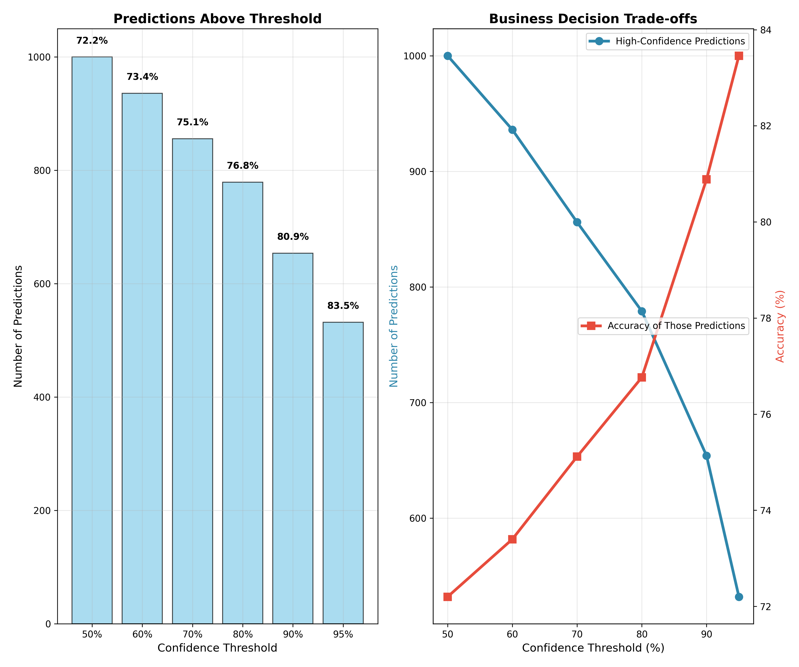

# Getting Confidence Scores from Language Model Classifications

> **TL;DR**: Language models don't just give you an answer—they give you a probability distribution over all possible answers. This project shows you how to extract genuine confidence scores from these probabilities, turning "I think it's positive" into "I'm 99.96% confident it's positive."


## Understanding How Language Models Actually Work

Most people think language models work like this:
1. You ask: *"Is 'I love this movie!' positive sentiment?"*
2. Model thinks: *"Yes, it's positive"*
3. You get: *"positive"*

**But that's not how it actually works.** Here's what really happens:

### The Token-by-Token Reality

Language models generate text **one token at a time**, and for each token, they produce **a probability distribution over all possible tokens**. Let's see this in action with a real example from our code:

```
INPUT: "Is this text positive in sentiment? Answer yes or no."
TEXT TO CLASSIFY: "I love this movie!"
```

**When the model generates the first token of its response, here's what it actually computes:**

```
FIRST TOKEN PROBABILITY DISTRIBUTION:
Rank  Token        Probability    Percentage    Log-Prob
-
 1.   "Yes     "    0.994130      99.41%      -0.006
 2.   "yes     "    0.003817       0.38%      -5.568
 3.   "YES     "    0.001616       0.16%      -6.428
 4.   "No      "    0.000349       0.03%      -7.959
 5.   "**      "    0.000065       0.01%      -9.647
 6.   "The     "    0.000003       0.00%      -12.725
 7.   "Answer  "    0.000002       0.00%      -13.100
 8.   "Maybe   "    0.000001       0.00%      -13.815
```

**The model selected: "Yes" (99.41% probability)**

### What This Means

1. **The model isn't certain—it's probabilistic**: It gives "Yes" a 99.41% chance, "yes" a 0.38% chance, etc.

2. **Every possible token gets a probability**: Even completely wrong answers like "The" get tiny probabilities (0.000003%)

3. **Log-probabilities are negative**: Higher probability = less negative log-prob. The -0.006 for "Yes" vs -7.959 for "No" shows the massive confidence difference.

4. **This is real confidence data**: Unlike a model just saying "I'm confident," these probabilities reflect the model's actual internal uncertainty.

### From Token Probabilities to Classification Confidence

Since we're doing sentiment classification, we need to aggregate related tokens:

```
SENTIMENT CLASSIFICATION AGGREGATION:
All "YES" variants (yes, Yes, YES, y, Y):  99.96%
All "NO" variants (no, No, NO, n, N):       0.04%

FINAL PREDICTION: POSITIVE
CONFIDENCE: 99.96%
```

**This 99.96% confidence score is mathematically grounded**—it's the sum of probabilities for all tokens that indicate positive sentiment.

### Controlling Token Selection

Here's the crucial insight: **Once the model computes that probability distribution, you have control over how it selects the final token.**

Think about it - the model just told us "Yes" has 99.41% probability, "yes" has 0.38%, "No" has 0.03%, etc. Now what? The transformer architecture gives us several ways to make the final choice:

#### Why This Control Matters

**For Creative Writing**: You want variety and surprise, so you might:
- Pick "yes" sometimes instead of always "Yes"
- Occasionally choose unexpected tokens for interesting prose
- Add randomness to avoid robotic, predictable text

**For Classification**: You want accuracy and reliability, so you:
- **Always pick the highest probability token** ("Yes" at 99.41%)
- Eliminate randomness to get consistent, deterministic results
- Extract the model's true confidence without noise

#### Temperature: The Primary Control

**Temperature** controls how much randomness gets added to the selection:

```python
# Temperature = 0.0 (what we use for confidence extraction)
# → Always picks highest probability token
# → "Yes" gets selected 100% of the time
# → Deterministic and reproducible

# Temperature = 1.0 (natural randomness)
# → Samples proportionally to probabilities
# → "Yes" gets picked ~99.4% of the time, "yes" ~0.4% of the time
# → Useful for creative writing or consistency analysis

# Temperature > 1.0 (more random)
# → Flattens the probability distribution
# → Even low-probability tokens get selected sometimes
# → Can reveal hidden model uncertainty
```

#### Other Sampling Parameters

**Top-K and Top-P** further control the selection process, but for confidence extraction we typically:
- Set **temperature = 0.0** (always pick most probable)
- Use **do_sample = False** (deterministic selection)
- Ignore Top-K/Top-P (not relevant when temperature = 0)

**The key point**: For reliable confidence scores, we configure the model to always select the most probable token, giving us the model's true "best guess" without any added randomness.


## Where You Can Get These Probabilities

### ✅ **Models That Expose Log-Probabilities**

**OpenAI API** (selected models):
```python
response = openai.ChatCompletion.create(
  model="gpt-4",
  messages=[{"role": "user", "content": "Is this positive? I love movies!"}],
  logprobs=True,        # This gives you the probabilities!
  top_logprobs=20       # Show top 20 alternatives
)
```

**Hugging Face Transformers** (what this project uses):
```python
outputs = model.generate(
  inputs,
  return_dict_in_generate=True,
  output_scores=True,     # This gives you logits → probabilities
  max_new_tokens=1
)
# Convert logits to probabilities
probs = F.softmax(outputs.scores[0], dim=-1)
```

**Local Models**: Ollama, vLLM, text-generation-webui, etc.

### ❌ **Models That Don't Expose Log-Probabilities**

- Claude (Anthropic) - No logprobs API
- GPT-4o reasoning models - Logprobs disabled
- Most commercial APIs - Logprobs not exposed
- Gemini (Google) - Limited logprobs support

**For these models, you can use Method 2: Consistency Analysis** (run the same prompt multiple times and measure agreement).


## Three Methods for Confidence Estimation

This project demonstrates three complementary approaches:

### Method 1: Token Probability Analysis ⚡
- **What**: Extract logprobs directly from model
- **Pros**: Single API call, mathematically precise
- **Cons**: Requires logprobs access
- **Best for**: OpenAI API, Hugging Face models, local inference

### Method 2: Response Consistency Analysis 🔄
- **What**: Run same prompt multiple times with temperature > 0, measure agreement
- **How**: Uses randomness to sample from the same probability distribution
- **Pros**: Works with any model, no logprobs API needed
- **Cons**: Multiple API calls, slower, indirect measurement
- **Best for**: Claude, GPT-4o, any model without logprobs access

### Method 3: Combined Approach 🎯
- **What**: Use both methods together
- **Pros**: Most robust confidence estimation
- **Cons**: More complex implementation
- **Best for**: Production systems requiring maximum accuracy


## Real Examples: High vs Low Confidence

Let's see how this works with different types of text:

### 🎯 **High Confidence Example**

**Text:** *"I absolutely love this amazing movie!"*

```
🎯 Model Prediction: 'Yes' → positive
Final confidence: 100.00%

📋 Binary Classification Probabilities:
  positive     1.0000 (logprob: -0.281) ← SELECTED
  negative     0.0000 (logprob: -10.531)

🔍 Token Details (Yes/No variations found):
  'yes     '   0.2450 (logprob: -1.406) [POS]
  'Yes     '   0.7547 (logprob: -0.281) [POS]  ← Generated token
  'YES     '   0.0002 (logprob: -8.453) [POS]
  'no      '   0.0000 (logprob: -14.860) [NEG]
  'No      '   0.0000 (logprob: -10.531) [NEG]
```

**Analysis:** Model is extremely certain - 99.97% of probability mass goes to positive tokens, with negative responses getting virtually zero probability.

### ⚠️ **Low Confidence Example**

**Text:** *"Best worst thing ever"*

```
🎯 Model Prediction: 'Yes' → positive
Final confidence: 52.11%

📋 Binary Classification Probabilities:
  positive     0.5211 (logprob: -1.005) ← SELECTED
  negative     0.4764 (logprob: -1.318)

🔍 Token Details (Yes/No variations found):
  'yes     '   0.1550 (logprob: -1.864) [POS]
  'Yes     '   0.3660 (logprob: -1.005) [POS]  ← Generated token
  'no      '   0.2085 (logprob: -1.568) [NEG]
  'No      '   0.2678 (logprob: -1.318) [NEG]

📊 Top 5 Most Likely Tokens:
  1. 'Yes     '   logprob: -1.005  (36.60%)
  2. 'No      '   logprob: -1.318  (26.78%)
  3. 'no      '   logprob: -1.568  (20.85%)
  4. 'yes     '   logprob: -1.864  (15.50%)
  5. 'Maybe   '   logprob: -7.396  (0.06%)
```

**Analysis:** Model is genuinely uncertain - probability mass is distributed almost evenly between positive (52.11%) and negative (47.64%) responses. The contradictory adjectives "Best worst" confuse the binary classifier.


## Quick Start

### Requirements

All methods use **Hugging Face Transformers** with **Llama 3.1**:

1. **Get Hugging Face Token**:
   ```bash
   # Visit https://huggingface.co/settings/tokens
   huggingface-cli login
   ```

2. **Request Llama Model Access**:
   - Visit [meta-llama/Llama-3.1-8B-Instruct](https://huggingface.co/meta-llama/Llama-3.1-8B-Instruct)
   - Request access (usually approved within hours)

3. **Install Dependencies**:
   ```bash
   pip install torch transformers accelerate
   ```

### Run the Demonstrations

**Method 1 - Real Logprobs:**
```bash
python logprobs_confidence.py
```

**Method 2 - Consistency Analysis:**
```bash
python consistency_confidence.py
```

**Method 3 - Combined Approach:**
```bash
python combined_confidence.py
```

**Full Demonstration:**
```bash
python main.py
```


## Implementation Details

### Method 1: Token Probability Analysis

```python
from transformers import AutoTokenizer, AutoModelForCausalLM
import torch.nn.functional as F

# Load model
tokenizer = AutoTokenizer.from_pretrained("meta-llama/Llama-3.1-8B-Instruct")
model = AutoModelForCausalLM.from_pretrained("meta-llama/Llama-3.1-8B-Instruct")

def get_confidence(text):
    # Create prompt
    prompt = f"Is this text positive? Answer yes or no.\n\nText: {text}\n\nAnswer: "

    # Generate with logits
    inputs = tokenizer(prompt, return_tensors="pt")
    outputs = model.generate(**inputs, max_new_tokens=1,
                            return_dict_in_generate=True, output_scores=True)

    # Extract probabilities
    logits = outputs.scores[0][0]
    probs = F.softmax(logits, dim=-1)

    # Aggregate yes/no probabilities
    yes_tokens = ["yes", "Yes", "YES", "y", "Y"]
    no_tokens = ["no", "No", "NO", "n", "N"]

    yes_prob = sum([probs[tokenizer.encode(token)[0]].item()
                    for token in yes_tokens if tokenizer.encode(token)])
    no_prob = sum([probs[tokenizer.encode(token)[0]].item()
                   for token in no_tokens if tokenizer.encode(token)])

    prediction = "positive" if yes_prob > no_prob else "negative"
    confidence = max(yes_prob, no_prob)

    return prediction, confidence
```

### Method 2: Response Consistency Analysis

**The key insight**: When logprobs aren't available, we can use **temperature sampling** to repeatedly sample from the same probability distribution that we saw earlier.

Remember our probability distribution?
```
 1. "Yes     "    99.41%
 2. "yes     "     0.38%
 3. "YES     "     0.16%
 4. "No      "     0.03%
```

With **temperature = 1.0**, if we run this 100 times:
- ~99 times we'll get "Yes" or "yes" (positive)
- ~1 time we'll get "No" (negative)
- **Agreement rate ≈ 99%** (matches the logprobs confidence!)

```python
def get_consistency_confidence(text, num_samples=10):
    responses = []

    # Run multiple classifications with temperature > 0
    for _ in range(num_samples):
        # CRITICAL: Use temperature > 0 for random sampling
        response = model.generate(
            prompt,
            temperature=1.0,  # Enable random sampling
            do_sample=True    # Don't always pick most probable
        )
        responses.append(parse_response(response))

    # Calculate agreement (indirect confidence measure)
    from collections import Counter
    counts = Counter(responses)
    most_common = counts.most_common(1)[0]
    prediction = most_common[0]
    confidence = most_common[1] / len(responses)  # Agreement rate

    return prediction, confidence, dict(counts)
```

**Why this works**: We're essentially using the model as a random number generator weighted by its internal probability distribution. High agreement = high internal confidence, low agreement = low internal confidence.

**The trade-off**: This is a slower, more expensive way to get information that's directly available from logprobs when supported.


## Key Insights From Our Experiments

### What Creates High Confidence (>99%)
- **Clear sentiment expressions**: "I absolutely love this amazing movie!"
- **Unambiguous language**: "This film is terrible and boring"
- **Standard English**: Well-represented in training data

### What Creates Low Confidence (50-60%)
- **Contradictory adjectives**: "Best worst thing ever"
- **Mixed emotions**: "Loving the hate"
- **Weakly positive statements**: "It's pretty good overall"
- **Ambiguous responses**: "Sure okay"

### What Doesn't Work (Still High Confidence)
- **Gen Z slang**: Llama 3.1 knows it surprisingly well
- **Sarcasm**: Model interprets contextually
- **Explicit uncertainty**: "I don't know how I feel" → 99%+ confidence

### The Calibration Challenge

Raw probabilities often need calibration:
- **Overconfident**: 90% probability might mean 70% actual accuracy
- **Underconfident**: 60% probability might mean 90% actual accuracy
- **Solution**: Collect validation data to build calibration curves


## Why This Matters

### Beyond Sentiment Analysis

This approach works for any classification task:
- **Content Moderation**: "How confident are you this is toxic?"
- **Medical Diagnosis**: "How certain is this cancer detection?"
- **Financial Risk**: "How confident is this fraud prediction?"
- **Legal Analysis**: "How certain is this contract clause interpretation?"

### Production Considerations

**When to trust high confidence:**
- Simple, well-defined tasks
- Text similar to training data
- Binary classifications with clear boundaries

**When to be skeptical:**
- Out-of-domain text
- Nuanced, subjective judgments
- High-stakes decisions

**Best practices:**
- Always validate on held-out data
- Use confidence thresholds for automated decisions
- Combine multiple methods for critical applications
- Monitor confidence distributions in production


## Technical Notes

### Hardware Requirements
- **CPU**: Works but slow (5-10 minutes per classification)
- **GPU**: 16GB+ VRAM recommended for 8B model
- **Apple Silicon**: Uses MPS acceleration automatically

### Model Compatibility
- **Llama 3.1**: Primary tested model
- **Other Transformers models**: Change model name in constructor
- **Quantized models**: Supported with reduced precision

### Troubleshooting
```bash
# Check authentication
huggingface-cli whoami

# Test model access
python -c "from transformers import AutoTokenizer; print('✅ Access granted!')"

# Monitor memory usage
python -c "import torch; print(f'CUDA: {torch.cuda.is_available()}')"
```

## Calibrating Confidence Scores

### Step 1: What Does Our Model Actually Produce?

Before we can fix confidence scores, we need to understand what our model gives us. Here are the raw confidence scores from our sentiment classifier on 1000 examples:


**What This Shows**: These are the confidence scores our model assigned to 1000 sentiment classification examples. The model produces scores ranging from 45% to 99% confidence, with an average of 74.6% confidence.

**The Critical Question**: Does 90% confidence really mean the model will be correct 90% of the time?

### Step 2: What Should Confidence Mean?

**Perfect calibration** means: *"When the model says it's X% confident, it should be correct exactly X% of the time."*

For example:
- Among all predictions where the model reports 80% confidence, exactly 80% should be correct
- Among all predictions where the model reports 60% confidence, exactly 60% should be correct
- **This is what we want**: Confidence scores you can trust for business decisions

**The Reality**: Most language models are **poorly calibrated**. They might say 90% confident but only be correct 60% of the time (overconfident), or say 60% confident but be correct 90% of the time (underconfident).

**The Solution**: Calibration algorithms that transform raw confidence scores into reliable probability estimates.

### Step 3: Measuring the Calibration Problem

To fix calibration, we first need to measure how bad the problem is. We use **reliability diagrams** that show the relationship between confidence and actual accuracy.


**How to Read This Chart**:
- **Blue dots**: Individual predictions (confidence vs. whether it was correct)
- **Red dots**: Bin averages - groups of predictions with similar confidence
- **Black diagonal line**: Perfect calibration (confidence = accuracy)
- **Numbers on red dots**: How many predictions are in that confidence range

**Interpreting the Red Dots**:
- **Red dots ON the diagonal**: Perfect calibration (confidence matches accuracy)
- **Red dots BELOW the diagonal**: Model is **overconfident** (claims higher confidence than actual accuracy)
- **Red dots ABOVE the diagonal**: Model is **underconfident** (claims lower confidence than actual accuracy)
- **Goal**: Move red dots closer to the diagonal line through calibration

**What We See in Our Raw Model**:
- **Red dots below the diagonal**: Model is **overconfident**
- **Example**: At 80% confidence, the model is only ~70% accurate
- **ECE = 0.151**: On average, confidence is off by 15.1 percentage points
- **This is the problem we need to fix!**

### Step 4: Calibration Methods - How to Fix It

We have different algorithms to fix poorly calibrated confidence scores. Each works differently:

#### Method 1: Platt Scaling (Logistic Regression)


**How It Works**: Uses logistic regression to learn a sigmoid-shaped mapping from raw confidence to calibrated confidence.

**Results**:
- **ECE improved**: 0.151 → 0.040 (much better!)
- **Red dots closer to diagonal**: Better calibration across most confidence ranges
- **Good for**: Smaller datasets (100-500 samples), assumes sigmoid relationship

#### Method 2: Isotonic Regression (Non-parametric)


**How It Works**: Learns a flexible, monotonic (always increasing) mapping without assuming any specific shape.

**Results**:
- **ECE = 0.000**: Perfect calibration! 
- **Red dots on diagonal**: Confidence exactly matches accuracy
- **Best for**: Larger datasets (1000+ samples), no shape assumptions

### Step 5: Fine-Grained Business Decision Charts

The bin-based reliability diagrams show the overall calibration quality, but for business decisions, we need to see performance at specific confidence thresholds.



**What This Shows**: 
- **X-axis**: Confidence threshold (e.g., "only make automated decisions above 80% confidence")
- **Y-axis**: Actual accuracy of predictions above that threshold
- **90% crosshairs**: The key business decision point

**Key Business Insight**:
- **Raw confidence (red)**: At 90% threshold, only ~88% accuracy (promises 90%, delivers 88%)
- **Calibrated confidence (green)**: At 90% threshold, exactly 90% accuracy (delivers on promise)

**This means**: With calibrated confidence, when you set a 90% threshold for automated decisions, you can trust that 90% of those decisions will be correct.

### Step 6: How Sample Size Affects Calibration Quality

More training data leads to better calibration. Here's how the business reliability charts improve with more labeled examples:


**Progressive Improvements with More Data**:

**Top-left (100 samples)**: Noisy calibration, significant gaps between raw and calibrated performance. Not ready for business use.

**Top-right (200 samples)**: Smoother calibration curves, calibrated confidence shows improvement but still has irregularities.

**Bottom-left (500 samples)**: Much smoother curves, calibrated confidence closely follows the perfect calibration diagonal. Getting close to business-ready quality.

**Bottom-right (1000 samples)**: Excellent calibration quality. Calibrated confidence nearly perfectly aligned with diagonal. **This is production-ready quality.**

**Sample Size Requirements for Business Use**:
- **Minimum viable**: 200+ samples for meaningful improvement
- **Production quality**: 1000+ samples for reliable automated decisions
- **Perfect calibration**: 1000+ samples with isotonic regression

### Implementation Files

**Core Calibration Methods**: [`calibration.py`](calibration.py)
- `PlattScalingCalibrator` - Logistic regression calibration
- `IsotonicRegressionCalibrator` - Non-parametric calibration  
- `TemperatureScalingCalibrator` - Neural network logit scaling

**Evaluation & Visualization**: [`calibration_metrics.py`](calibration_metrics.py)
- `expected_calibration_error()` - ECE calculation with 20 bins
- `maximum_calibration_error()` - MCE calculation  
- `plot_reliability_diagram()` - Confidence vs accuracy plots
- `calibration_metrics()` - Comprehensive evaluation suite

**Complete Workflow Demo**: [`calibration_demo.py`](calibration_demo.py)
- End-to-end calibration pipeline
- Integration with confidence extraction methods
- Business decision threshold analysis
- All visualizations used in this README

### Quick Start with Calibration

```bash
# Install calibration dependencies
pip install scikit-learn matplotlib

# Run the complete calibration demonstration
python calibration_demo.py

# Create individual method comparisons
python create_calibration_method_comparison.py

# Create raw confidence histogram
python create_raw_confidence_histogram.py
```

### Integration with Your Confidence Methods

The calibration system works with all confidence estimation approaches:

- **Method 1 (Token Probabilities)**: Calibrate logprob-based confidence
- **Method 2 (Response Consistency)**: Calibrate agreement-based confidence  
- **Method 3 (Combined Methods)**: Calibrate ensemble confidence scores

### Key Metrics Explained

- **Expected Calibration Error (ECE)**: Average calibration gap across 20 confidence bins
- **Maximum Calibration Error (MCE)**: Worst-case calibration gap in any single bin
- **Reliability Diagrams**: Visual plots showing confidence vs actual accuracy
- **Business Decision Charts**: Fine-grained threshold analysis for automated decisions

**Why We Use 20 Bins Instead of 10**:
- **Finer granularity**: 20 bins (0-5%, 5-10%, etc.) vs 10 bins (0-10%, 10-20%, etc.)
- **Better detection**: More bins can reveal calibration problems that 10 bins might miss
- **Still manageable**: 20 bins provides good detail without being overwhelming

**Key Takeaway**: Calibration transforms raw confidence scores into reliable probability estimates, enabling trustworthy automated decision making where "90% confident = 90% correct."

## Contributing

Found an interesting confidence pattern? Discovered a better uncertainty detection method?

1. **Fork the repository**
2. **Run experiments** with different models/text types
3. **Document your findings** with concrete examples
4. **Submit a pull request** with your improvements

This is an active area of research - your contributions help everyone build more reliable AI systems.

## References & Further Reading

### Core Research

- **Semantic Uncertainty**: Kuhn, L., Gal, Y., & Farquhar, S. (2023). *Semantic uncertainty: Linguistic invariances for uncertainty estimation in natural language generation.* ICLR 2023. [[Paper](https://arxiv.org/abs/2302.09664)]

- **Model Calibration**: Kadavath, S., et al. (2022). *Language models (mostly) know what they know.* arXiv:2207.05221. [[Paper](https://arxiv.org/abs/2207.05221)]

- **Expressing Uncertainty**: Lin, S., Hilton, J., & Evans, O. (2022). *Teaching models to express their uncertainty in words.* arXiv:2205.14334. [[Paper](https://arxiv.org/abs/2205.14334)]

### Methodological Foundations

- **Consistency Methods**: Manakul, P., Liusie, A., & Gales, M. J. (2023). *SelfCheckGPT: Zero-resource black-box hallucination detection for generative large language models.* EMNLP 2023. [[Paper](https://arxiv.org/abs/2303.08896)]

- **Uncertainty Types**: Kendall, A., & Gal, Y. (2017). *What uncertainties do we need in Bayesian deep learning for computer vision?* NIPS 2017. [[Paper](https://arxiv.org/abs/1703.04977)]

- **Token Probability Analysis**: Wang, S., Liu, Y., Xu, C., Zhu, P., Lu, A., Zhu, S., & Meng, F. (2019). *Analyzing uncertainty in neural machine translation.* ICML 2019. [[Paper](https://arxiv.org/abs/1901.07540)]

### Calibration Research

- **Modern Neural Network Calibration**: Guo, C., Pleiss, G., Sun, Y., & Weinberger, K. Q. (2017). *On calibration of modern neural networks.* ICML 2017. [[Paper](https://arxiv.org/abs/1706.04599)]


- **Platt Scaling**: Platt, J. (1999). *Probabilistic outputs for support vector machines and comparisons to regularized likelihood methods.* Advances in Large Margin Classifiers. [[Paper](https://www.researchgate.net/publication/2594015_Probabilistic_Outputs_for_Support_Vector_Machines_and_Comparisons_to_Regularized_Likelihood_Methods)]

- **Calibration Evaluation**: Naeini, M. P., Cooper, G., & Hauskrecht, M. (2015). *Obtaining well calibrated probabilities using Bayesian binning.* AAAI 2015. [[Paper](https://arxiv.org/abs/1411.3794)]

### Practical Applications

- **Constitutional AI**: Bai, Y., et al. (2022). *Constitutional AI: Harmlessness from AI feedback.* arXiv:2212.08073. [[Paper](https://arxiv.org/abs/2212.08073)]

- **Compositionality & Consistency**: Press, O., Zhang, M., Min, S., Schmidt, L., Smith, N. A., & Lewis, M. (2023). *Measuring and narrowing the compositionality gap in language models.* EMNLP 2023. [[Paper](https://arxiv.org/abs/2210.03350)]

### Related Tools & Libraries

- **Transformers Library**: Wolf, T., et al. (2020). *Transformers: State-of-the-art natural language processing.* EMNLP 2020. [[GitHub](https://github.com/huggingface/transformers)] [[Paper](https://arxiv.org/abs/1910.03771)]

- **Uncertainty Quantification Resources**: See [awesome-uncertainty-deeplearning](https://github.com/ENSTA-U2IS/awesome-uncertainty-deeplearning) for comprehensive resources on uncertainty in deep learning

### Historical Context

- **Early Calibration Work**: Guo, C., Pleiss, G., Sun, Y., & Weinberger, K. Q. (2017). *On calibration of modern neural networks.* ICML 2017. [[Paper](https://arxiv.org/abs/1706.04599)]

- **Bayesian Deep Learning**: Gal, Y., & Ghahramani, Z. (2016). *Dropout as a Bayesian approximation: Representing model uncertainty in deep learning.* ICML 2016. [[Paper](https://arxiv.org/abs/1506.02142)]
