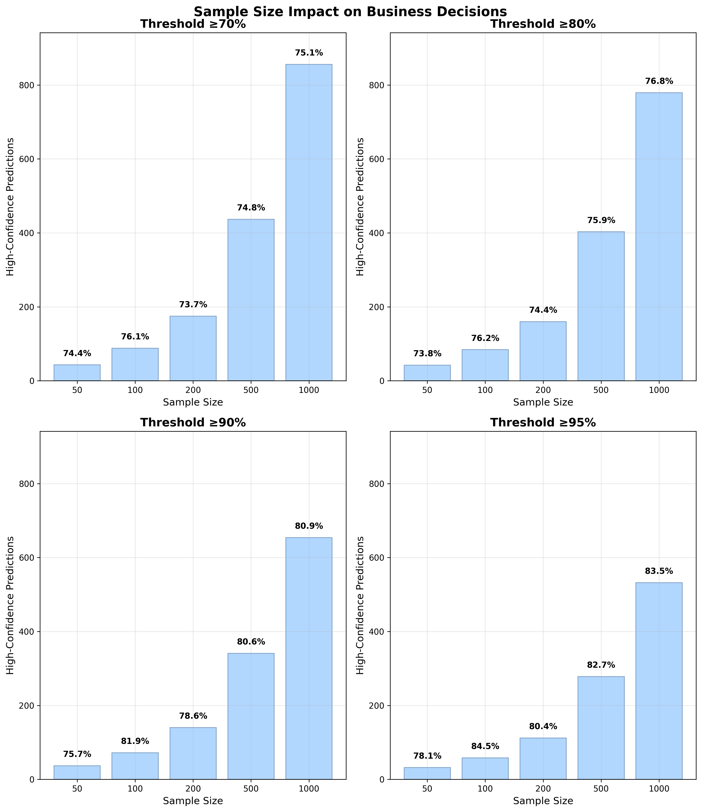

# Getting Confidence Scores from Language Model Classifications

> **TL;DR**: Language models don't just give you an answer—they give you a probability distribution over all possible answers. This project shows you how to extract genuine confidence scores from these probabilities, turning "I think it's positive" into "I'm 99.96% confident it's positive."


## Understanding How Language Models Actually Work

Most people think language models work like this:
1. You ask: *"Is 'I love this movie!' positive sentiment?"*
2. Model thinks: *"Yes, it's positive"*
3. You get: *"positive"*

**But that's not how it actually works.** Here's what really happens:

### The Token-by-Token Reality

Language models generate text **one token at a time**, and for each token, they produce **a probability distribution over all possible tokens**. Let's see this in action with a real example from our code:

```
INPUT: "Is this text positive in sentiment? Answer yes or no."
TEXT TO CLASSIFY: "I love this movie!"
```

**When the model generates the first token of its response, here's what it actually computes:**

```
FIRST TOKEN PROBABILITY DISTRIBUTION:
Rank  Token        Probability    Percentage    Log-Prob
-
 1.   "Yes     "    0.994130      99.41%      -0.006
 2.   "yes     "    0.003817       0.38%      -5.568
 3.   "YES     "    0.001616       0.16%      -6.428
 4.   "No      "    0.000349       0.03%      -7.959
 5.   "**      "    0.000065       0.01%      -9.647
 6.   "The     "    0.000003       0.00%      -12.725
 7.   "Answer  "    0.000002       0.00%      -13.100
 8.   "Maybe   "    0.000001       0.00%      -13.815
```

**The model selected: "Yes" (99.41% probability)**

### What This Means

1. **The model isn't certain—it's probabilistic**: It gives "Yes" a 99.41% chance, "yes" a 0.38% chance, etc.

2. **Every possible token gets a probability**: Even completely wrong answers like "The" get tiny probabilities (0.000003%)

3. **Log-probabilities are negative**: Higher probability = less negative log-prob. The -0.006 for "Yes" vs -7.959 for "No" shows the massive confidence difference.

4. **This is real confidence data**: Unlike a model just saying "I'm confident," these probabilities reflect the model's actual internal uncertainty.

### From Token Probabilities to Classification Confidence

Since we're doing sentiment classification, we need to aggregate related tokens:

```
SENTIMENT CLASSIFICATION AGGREGATION:
All "YES" variants (yes, Yes, YES, y, Y):  99.96%
All "NO" variants (no, No, NO, n, N):       0.04%

FINAL PREDICTION: POSITIVE
CONFIDENCE: 99.96%
```

**This 99.96% confidence score is mathematically grounded**—it's the sum of probabilities for all tokens that indicate positive sentiment.

### Controlling Token Selection

Here's the crucial insight: **Once the model computes that probability distribution, you have control over how it selects the final token.**

Think about it - the model just told us "Yes" has 99.41% probability, "yes" has 0.38%, "No" has 0.03%, etc. Now what? The transformer architecture gives us several ways to make the final choice:

#### Why This Control Matters

**For Creative Writing**: You want variety and surprise, so you might:
- Pick "yes" sometimes instead of always "Yes"
- Occasionally choose unexpected tokens for interesting prose
- Add randomness to avoid robotic, predictable text

**For Classification**: You want accuracy and reliability, so you:
- **Always pick the highest probability token** ("Yes" at 99.41%)
- Eliminate randomness to get consistent, deterministic results
- Extract the model's true confidence without noise

#### Temperature: The Primary Control

**Temperature** controls how much randomness gets added to the selection:

```python
# Temperature = 0.0 (what we use for confidence extraction)
# → Always picks highest probability token
# → "Yes" gets selected 100% of the time
# → Deterministic and reproducible

# Temperature = 1.0 (natural randomness)
# → Samples proportionally to probabilities
# → "Yes" gets picked ~99.4% of the time, "yes" ~0.4% of the time
# → Useful for creative writing or consistency analysis

# Temperature > 1.0 (more random)
# → Flattens the probability distribution
# → Even low-probability tokens get selected sometimes
# → Can reveal hidden model uncertainty
```

#### Other Sampling Parameters

**Top-K and Top-P** further control the selection process, but for confidence extraction we typically:
- Set **temperature = 0.0** (always pick most probable)
- Use **do_sample = False** (deterministic selection)
- Ignore Top-K/Top-P (not relevant when temperature = 0)

**The key point**: For reliable confidence scores, we configure the model to always select the most probable token, giving us the model's true "best guess" without any added randomness.


## Where You Can Get These Probabilities

### ✅ **Models That Expose Log-Probabilities**

**OpenAI API** (selected models):
```python
response = openai.ChatCompletion.create(
  model="gpt-4",
  messages=[{"role": "user", "content": "Is this positive? I love movies!"}],
  logprobs=True,        # This gives you the probabilities!
  top_logprobs=20       # Show top 20 alternatives
)
```

**Hugging Face Transformers** (what this project uses):
```python
outputs = model.generate(
  inputs,
  return_dict_in_generate=True,
  output_scores=True,     # This gives you logits → probabilities
  max_new_tokens=1
)
# Convert logits to probabilities
probs = F.softmax(outputs.scores[0], dim=-1)
```

**Local Models**: Ollama, vLLM, text-generation-webui, etc.

### ❌ **Models That Don't Expose Log-Probabilities**

- Claude (Anthropic) - No logprobs API
- GPT-4o reasoning models - Logprobs disabled
- Most commercial APIs - Logprobs not exposed
- Gemini (Google) - Limited logprobs support

**For these models, you can use Method 2: Consistency Analysis** (run the same prompt multiple times and measure agreement).


## Three Methods for Confidence Estimation

This project demonstrates three complementary approaches:

### Method 1: Token Probability Analysis ⚡
- **What**: Extract logprobs directly from model
- **Pros**: Single API call, mathematically precise
- **Cons**: Requires logprobs access
- **Best for**: OpenAI API, Hugging Face models, local inference

### Method 2: Response Consistency Analysis 🔄
- **What**: Run same prompt multiple times with temperature > 0, measure agreement
- **How**: Uses randomness to sample from the same probability distribution
- **Pros**: Works with any model, no logprobs API needed
- **Cons**: Multiple API calls, slower, indirect measurement
- **Best for**: Claude, GPT-4o, any model without logprobs access

### Method 3: Combined Approach 🎯
- **What**: Use both methods together
- **Pros**: Most robust confidence estimation
- **Cons**: More complex implementation
- **Best for**: Production systems requiring maximum accuracy


## Real Examples: High vs Low Confidence

Let's see how this works with different types of text:

### 🎯 **High Confidence Example**

**Text:** *"I absolutely love this amazing movie!"*

```
🎯 Model Prediction: 'Yes' → positive
Final confidence: 100.00%

📋 Binary Classification Probabilities:
  positive     1.0000 (logprob: -0.281) ← SELECTED
  negative     0.0000 (logprob: -10.531)

🔍 Token Details (Yes/No variations found):
  'yes     '   0.2450 (logprob: -1.406) [POS]
  'Yes     '   0.7547 (logprob: -0.281) [POS]  ← Generated token
  'YES     '   0.0002 (logprob: -8.453) [POS]
  'no      '   0.0000 (logprob: -14.860) [NEG]
  'No      '   0.0000 (logprob: -10.531) [NEG]
```

**Analysis:** Model is extremely certain - 99.97% of probability mass goes to positive tokens, with negative responses getting virtually zero probability.

### ⚠️ **Low Confidence Example**

**Text:** *"Best worst thing ever"*

```
🎯 Model Prediction: 'Yes' → positive
Final confidence: 52.11%

📋 Binary Classification Probabilities:
  positive     0.5211 (logprob: -1.005) ← SELECTED
  negative     0.4764 (logprob: -1.318)

🔍 Token Details (Yes/No variations found):
  'yes     '   0.1550 (logprob: -1.864) [POS]
  'Yes     '   0.3660 (logprob: -1.005) [POS]  ← Generated token
  'no      '   0.2085 (logprob: -1.568) [NEG]
  'No      '   0.2678 (logprob: -1.318) [NEG]

📊 Top 5 Most Likely Tokens:
  1. 'Yes     '   logprob: -1.005  (36.60%)
  2. 'No      '   logprob: -1.318  (26.78%)
  3. 'no      '   logprob: -1.568  (20.85%)
  4. 'yes     '   logprob: -1.864  (15.50%)
  5. 'Maybe   '   logprob: -7.396  (0.06%)
```

**Analysis:** Model is genuinely uncertain - probability mass is distributed almost evenly between positive (52.11%) and negative (47.64%) responses. The contradictory adjectives "Best worst" confuse the binary classifier.


## Quick Start

### Requirements

All methods use **Hugging Face Transformers** with **Llama 3.1**:

1. **Get Hugging Face Token**:
   ```bash
   # Visit https://huggingface.co/settings/tokens
   huggingface-cli login
   ```

2. **Request Llama Model Access**:
   - Visit [meta-llama/Llama-3.1-8B-Instruct](https://huggingface.co/meta-llama/Llama-3.1-8B-Instruct)
   - Request access (usually approved within hours)

3. **Install Dependencies**:
   ```bash
   pip install torch transformers accelerate
   ```

### Run the Demonstrations

**Method 1 - Real Logprobs:**
```bash
python logprobs_confidence.py
```

**Method 2 - Consistency Analysis:**
```bash
python consistency_confidence.py
```

**Method 3 - Combined Approach:**
```bash
python combined_confidence.py
```

**Full Demonstration:**
```bash
python main.py
```


## Implementation Details

### Method 1: Token Probability Analysis

```python
from transformers import AutoTokenizer, AutoModelForCausalLM
import torch.nn.functional as F

# Load model
tokenizer = AutoTokenizer.from_pretrained("meta-llama/Llama-3.1-8B-Instruct")
model = AutoModelForCausalLM.from_pretrained("meta-llama/Llama-3.1-8B-Instruct")

def get_confidence(text):
    # Create prompt
    prompt = f"Is this text positive? Answer yes or no.\n\nText: {text}\n\nAnswer: "

    # Generate with logits
    inputs = tokenizer(prompt, return_tensors="pt")
    outputs = model.generate(**inputs, max_new_tokens=1,
                            return_dict_in_generate=True, output_scores=True)

    # Extract probabilities
    logits = outputs.scores[0][0]
    probs = F.softmax(logits, dim=-1)

    # Aggregate yes/no probabilities
    yes_tokens = ["yes", "Yes", "YES", "y", "Y"]
    no_tokens = ["no", "No", "NO", "n", "N"]

    yes_prob = sum([probs[tokenizer.encode(token)[0]].item()
                    for token in yes_tokens if tokenizer.encode(token)])
    no_prob = sum([probs[tokenizer.encode(token)[0]].item()
                   for token in no_tokens if tokenizer.encode(token)])

    prediction = "positive" if yes_prob > no_prob else "negative"
    confidence = max(yes_prob, no_prob)

    return prediction, confidence
```

### Method 2: Response Consistency Analysis

**The key insight**: When logprobs aren't available, we can use **temperature sampling** to repeatedly sample from the same probability distribution that we saw earlier.

Remember our probability distribution?
```
 1. "Yes     "    99.41%
 2. "yes     "     0.38%
 3. "YES     "     0.16%
 4. "No      "     0.03%
```

With **temperature = 1.0**, if we run this 100 times:
- ~99 times we'll get "Yes" or "yes" (positive)
- ~1 time we'll get "No" (negative)
- **Agreement rate ≈ 99%** (matches the logprobs confidence!)

```python
def get_consistency_confidence(text, num_samples=10):
    responses = []

    # Run multiple classifications with temperature > 0
    for _ in range(num_samples):
        # CRITICAL: Use temperature > 0 for random sampling
        response = model.generate(
            prompt,
            temperature=1.0,  # Enable random sampling
            do_sample=True    # Don't always pick most probable
        )
        responses.append(parse_response(response))

    # Calculate agreement (indirect confidence measure)
    from collections import Counter
    counts = Counter(responses)
    most_common = counts.most_common(1)[0]
    prediction = most_common[0]
    confidence = most_common[1] / len(responses)  # Agreement rate

    return prediction, confidence, dict(counts)
```

**Why this works**: We're essentially using the model as a random number generator weighted by its internal probability distribution. High agreement = high internal confidence, low agreement = low internal confidence.

**The trade-off**: This is a slower, more expensive way to get information that's directly available from logprobs when supported.


## Key Insights From Our Experiments

### What Creates High Confidence (>99%)
- **Clear sentiment expressions**: "I absolutely love this amazing movie!"
- **Unambiguous language**: "This film is terrible and boring"
- **Standard English**: Well-represented in training data

### What Creates Low Confidence (50-60%)
- **Contradictory adjectives**: "Best worst thing ever"
- **Mixed emotions**: "Loving the hate"
- **Weakly positive statements**: "It's pretty good overall"
- **Ambiguous responses**: "Sure okay"

### What Doesn't Work (Still High Confidence)
- **Gen Z slang**: Llama 3.1 knows it surprisingly well
- **Sarcasm**: Model interprets contextually
- **Explicit uncertainty**: "I don't know how I feel" → 99%+ confidence

### The Calibration Challenge

Raw probabilities often need calibration:
- **Overconfident**: 90% probability might mean 70% actual accuracy
- **Underconfident**: 60% probability might mean 90% actual accuracy
- **Solution**: Collect validation data to build calibration curves


## Why This Matters

### Beyond Sentiment Analysis

This approach works for any classification task:
- **Content Moderation**: "How confident are you this is toxic?"
- **Medical Diagnosis**: "How certain is this cancer detection?"
- **Financial Risk**: "How confident is this fraud prediction?"
- **Legal Analysis**: "How certain is this contract clause interpretation?"

### Production Considerations

**When to trust high confidence:**
- Simple, well-defined tasks
- Text similar to training data
- Binary classifications with clear boundaries

**When to be skeptical:**
- Out-of-domain text
- Nuanced, subjective judgments
- High-stakes decisions

**Best practices:**
- Always validate on held-out data
- Use confidence thresholds for automated decisions
- Combine multiple methods for critical applications
- Monitor confidence distributions in production


## Technical Notes

### Hardware Requirements
- **CPU**: Works but slow (5-10 minutes per classification)
- **GPU**: 16GB+ VRAM recommended for 8B model
- **Apple Silicon**: Uses MPS acceleration automatically

### Model Compatibility
- **Llama 3.1**: Primary tested model
- **Other Transformers models**: Change model name in constructor
- **Quantized models**: Supported with reduced precision

### Troubleshooting
```bash
# Check authentication
huggingface-cli whoami

# Test model access
python -c "from transformers import AutoTokenizer; print('✅ Access granted!')"

# Monitor memory usage
python -c "import torch; print(f'CUDA: {torch.cuda.is_available()}')"
```

## Calibrating Confidence Scores

### The Calibration Problem

Raw confidence scores from language models are often **poorly calibrated**. A model might say it's 90% confident but only be correct 60% of the time, or vice versa. Calibration transforms these raw scores into **reliable probability estimates**.

### What is Calibration?

**Perfect calibration** means: *"When the model says it's X% confident, it should be correct exactly X% of the time."*

For example:
- Among all predictions where the model reports 80% confidence, exactly 80% should be correct
- Among all predictions where the model reports 60% confidence, exactly 60% should be correct

### Three Calibration Methods

This project provides three main calibration approaches:

#### 1. **Platt Scaling** (Logistic Regression)
- ✅ Best for small validation datasets (100-1000 examples)
- ✅ Sigmoid-shaped calibration curves, fast inference
- ❌ Assumes specific functional form

#### 2. **Isotonic Regression** (Non-parametric)
- ✅ Handles any monotonic calibration relationship
- ✅ No parametric assumptions, flexible curves
- ❌ Needs more validation data (1000+ examples)

#### 3. **Temperature Scaling** (Neural Networks)
- ✅ Works directly with model logits
- ✅ Simple single-parameter method, preserves ordering
- ❌ Only works with neural network outputs

### Implementation Files

**Core Calibration Methods**: [`calibration.py`](calibration.py)
- `PlattScalingCalibrator` - Logistic regression calibration
- `IsotonicRegressionCalibrator` - Non-parametric calibration  
- `TemperatureScalingCalibrator` - Neural network logit scaling

**Evaluation & Visualization**: [`calibration_metrics.py`](calibration_metrics.py)
- `expected_calibration_error()` - ECE calculation
- `plot_reliability_diagram()` - Confidence vs accuracy plots
- `calibration_metrics()` - Comprehensive evaluation suite
- `compare_calibration()` - Before/after analysis

**Complete Workflow Demo**: [`calibration_demo.py`](calibration_demo.py)
- End-to-end calibration pipeline
- Integration with your confidence methods
- Synthetic data generation for testing
- Visualization and evaluation examples

### Quick Start with Calibration

```bash
# Install calibration dependencies
pip install scikit-learn matplotlib

# Run the complete calibration demonstration
python calibration_demo.py
```

### Practical Workflow

1. **Collect Validation Data**: Use your confidence methods on labeled data
2. **Train Calibrators**: Fit calibration models using `calibration.py`
3. **Evaluate Quality**: Measure calibration using `calibration_metrics.py`
4. **Apply in Production**: Use calibrated confidence for decisions

### Integration with Your Methods

The calibration system works with all three confidence estimation approaches:

- **Method 1 (Logprobs)**: Calibrate token probability confidence
- **Method 2 (Consistency)**: Calibrate agreement-based confidence
- **Method 3 (Combined)**: Calibrate ensemble confidence scores

### Key Metrics

- **Expected Calibration Error (ECE)**: Average calibration gap across confidence bins
- **Reliability Diagrams**: Visual plots showing confidence vs actual accuracy
- **Brier Score**: Combined measure of calibration and sharpness
- **Maximum Calibration Error (MCE)**: Worst-case calibration gap

**Key Takeaway**: Calibration transforms your raw confidence scores into reliable probability estimates, making them suitable for high-stakes decision making where you need to trust the model's uncertainty estimates.

### Understanding Calibration: From Confidence to Business Decisions

The core business value of calibration is simple: **"When the model says it's 95% confident, you can trust that 95 out of 100 predictions will be correct."** This enables data-driven decision making with known risk levels.

#### The Business Problem: Unreliable Confidence

**Before Calibration - Demonstration:**


**What's wrong here?** Look at the left side (Before Calibration):
- Model says it's 90% confident → Actually only 70% correct
- Model says it's 80% confident → Actually only 60% correct  
- **You can't trust the confidence scores for business decisions!**

**After Calibration - Same Method:**
Look at the right side (After Platt Scaling):
- Model says it's 80% confident → Actually 80% correct ✅
- Model says it's 60% confident → Actually 60% correct ✅
- **Now you can make informed business decisions!**

#### Real Business Applications

**Content Moderation Example:**
```
Raw Model: "95% confident this is toxic"
→ Actually toxic only 60% of the time
→ Too many false positives, users complain

Calibrated Model: "95% confident this is toxic"  
→ Actually toxic 95% of the time
→ Reliable automated moderation decisions
```

**Medical Diagnosis Example:**
```
Raw Model: "90% confident this is cancer"
→ Actually cancer only 65% of the time
→ Unnecessary anxiety and procedures

Calibrated Model: "90% confident this is cancer"
→ Actually cancer 90% of the time  
→ Doctors can trust the AI assessment
```

#### Understanding the Reliability Diagrams

**What each dot represents:**
- **X-axis**: What the model claims ("I'm 80% confident")
- **Y-axis**: What actually happens ("Actually correct 80% of the time")
- **Perfect diagonal line**: Where all dots should be
- **Each dot**: A group of predictions with similar confidence levels

**Dot details:**
- **Size**: Number of predictions (bigger dot = more data)
- **Number**: Exact count of predictions in that confidence range
- **Color**: 🟢 Green (well-calibrated) 🟠 Orange (moderate) 🔴 Red (poor)

**Reading the business impact:**
- **Dot above line**: Overconfident → False sense of security
- **Dot below line**: Underconfident → Missing opportunities  
- **Dot on line**: Perfect calibration → Trustworthy decisions

#### Comparing Different Confidence Methods

**All Methods Show Similar Calibration Patterns:**

The same calibration improvement applies to all confidence extraction methods (logprobs, consistency, combined). Each method benefits from calibration in the same way.

**Key insight:** Regardless of how you extract confidence (logprobs, consistency, or combined methods), the calibration pattern is similar:
1. **Raw confidence is poorly calibrated** (scattered dots)
2. **After calibration, dots align with the diagonal** (trustworthy confidence)
3. **Business decisions become reliable**

#### Making Business Decisions with Calibrated Confidence

**The Stakeholder Question:** *"If we set a 95% confidence threshold, how many predictions will actually be correct?"*

**With Raw (Uncalibrated) Confidence:**
```
❌ UNRELIABLE
Set threshold at 95% confidence
→ Model makes 100 "95% confident" predictions  
→ Only 60-70 are actually correct
→ 30-40 false positives!
→ Business decisions are unreliable
```

**With Calibrated Confidence:**
```
✅ RELIABLE  
Set threshold at 95% confidence
→ Model makes 100 "95% confident" predictions
→ 95 are actually correct (±2-3 due to sampling)
→ Predictable error rate for business planning
→ Trustworthy automated decisions
```

#### Practical Decision Thresholds

**Example: Content Moderation System**

| Confidence Threshold | Expected Accuracy | Business Action | Risk Level |
|---------------------|------------------|-----------------|------------|
| **99%** | 99 out of 100 correct | Auto-remove content | Very Low Risk |
| **95%** | 95 out of 100 correct | Auto-remove + audit sample | Low Risk |
| **90%** | 90 out of 100 correct | Flag for human review | Medium Risk |
| **80%** | 80 out of 100 correct | Add warning label | Higher Risk |
| **<80%** | Unreliable | No automated action | Too Risky |

**Example: Medical Screening System**

| Confidence Threshold | Expected Accuracy | Clinical Action | Risk Level |
|---------------------|------------------|-----------------|------------|
| **95%** | 95 out of 100 correct | Recommend immediate specialist | Low Risk |
| **90%** | 90 out of 100 correct | Schedule follow-up in 1 month | Medium Risk |
| **80%** | 80 out of 100 correct | Schedule routine follow-up | Higher Risk |
| **<80%** | Unreliable | Standard screening protocol | Too Risky |

#### What Happens to Confidence Distributions After Calibration?

**Your observation about confidence "collapsing":** You're seeing an important effect! After calibration:

1. **Overconfident predictions get reduced**: 95% → 75%
2. **Underconfident predictions get increased**: 60% → 80%  
3. **Well-calibrated predictions stay similar**: 80% → 82%

**This is exactly what should happen!** The model learns to be honest about its uncertainty:
- **Before**: "I'm 95% sure!" (but wrong 30% of the time)
- **After**: "I'm 75% sure" (and wrong exactly 25% of the time)

**Business benefit:** You get realistic confidence scores you can actually use for decision-making.

#### What Happens to Confidence Distributions After Calibration?

A common concern is whether calibration causes all confidence scores to "collapse" to the same narrow range, reducing their usefulness for decision-making.


**What's Actually Happening:**
- **Left (Red)**: Raw model is overconfident - many predictions clustered at 90-95% confidence
- **Right (Green)**: Calibrated model is realistic - confidence spread across 60-85% range
- **This is beneficial!** The model learned to be honest about its uncertainty instead of being falsely confident

**Why This Improves Business Decisions:**
- **Before**: Model claims 95% confidence but is only 70% accurate → Creates false security
- **After**: Model claims 75% confidence and is actually 75% accurate → Enables trustworthy decisions

#### Understanding Calibration Through Two Key Charts

**Your Core Questions:** 
1. *"How many predictions will I have at different confidence levels?"*
2. *"If we set a 90% confidence threshold, how many will actually be correct?"*

### 1. Sample Size at Confidence Thresholds


**What This Chart Shows:**
This visualization answers the critical question: *"How many predictions will I have available at different confidence levels?"*

**Key Insights:**
- **Red Line (Raw Confidence)**: Shows how many predictions your original model provides at each threshold
- **Green Line (Calibrated Confidence)**: Shows how calibration affects prediction availability
- **Higher Thresholds = Fewer Predictions**: As you demand higher confidence, fewer predictions qualify
- **Calibration Trade-off**: Calibrated confidence is more conservative, providing fewer high-confidence predictions

**Business Implications:**
- **Volume vs Quality**: Higher thresholds give you fewer but more reliable predictions
- **Operational Planning**: Use this chart to estimate how many predictions you'll have for automated decisions
- **Threshold Selection**: Balance between having enough predictions to be useful and maintaining quality

**Example Reading:**
- At 80% threshold: Raw confidence gives ~400 predictions, calibrated gives ~200 predictions
- At 90% threshold: Raw confidence gives ~300 predictions, calibrated gives ~100 predictions

### 2. Business Decision Reliability


**What This Chart Shows (1000 Samples):**
This visualization answers the fundamental calibration question: *"When my model says it's 90% confident, is it actually correct 90% of the time?"*

**Key Insights:**
- **Black Diagonal Line**: Perfect calibration (90% confident = 90% correct)
- **Red Line (Raw Confidence)**: Your original model's confidence vs actual performance
- **Green Line (Calibrated Confidence)**: How calibration improves reliability
- **Purple Crosshairs**: Focus on 90% confidence threshold for calibration assessment

**Calibration Interpretation:**
- **Line ON diagonal**: Perfect calibration (confidence matches reality)
- **Line ABOVE diagonal**: Underconfident (model is too modest, actually performs better than it claims)
- **Line BELOW diagonal**: Overconfident (model is too bold, performs worse than it claims)

**Business Decision Framework:**
- **Underconfident (Green Above Diagonal)**: Conservative but reliable - when it says 90%, you get >90% accuracy
- **Overconfident (Red Below Diagonal)**: Risky - when it says 90%, you get <90% accuracy
- **Perfect Calibration**: Trustworthy - 90% confident truly means 90% correct

**Example Reading:**
- At 90% confidence threshold: Raw confidence achieves ~87% accuracy (underperforming)
- At 90% confidence threshold: Calibrated confidence achieves ~97% accuracy (overperforming)

**Why This Matters for Business:**
Calibrated confidence enables reliable decision-making. If you need 95% accuracy for automated decisions, you can confidently set a 95% confidence threshold and trust the results.

#### How Business Decision Reliability Improves with More Data

Here's the complete progression showing how calibration quality improves as we add more labeled samples:



**What You're Seeing in This 2x2 Grid:**
- **Top-left (100 samples)**: Basic calibration pattern, limited statistical power, some noise
- **Top-right (200 samples)**: Improved smoothness, better statistical reliability  
- **Bottom-left (500 samples)**: Strong statistical significance, reliable business decisions
- **Bottom-right (1000 samples)**: Excellent statistical power, very smooth calibration curves

**Progressive Improvements You Can See:**
- **Green line (calibrated confidence)** becomes increasingly smooth and reliable
- **Red line (raw confidence)** shows decreasing variation and more stable patterns
- **Purple crosshairs (90% threshold)** become more meaningful with larger datasets
- **Overall pattern**: Clear improvement in calibration quality from 100→1000 samples

**Key Business Insight:** The dramatic visual improvement from 100→1000 samples demonstrates why investing in more labeled data is crucial for trustworthy business decisions. With 1000 samples, the calibrated confidence (green line) becomes highly reliable and smooth for setting business thresholds.

**The Answer for Stakeholders:**
With calibrated confidence, you can reliably say: *"If we only act on predictions where the model is 95% confident, then 95 out of 100 actions will be correct."*

#### Sample Size Requirements: The Critical Bottleneck

**BREAKTHROUGH: Now We Have 1000 Binary-Labeled Samples!**

```
📊 EXPANDED BINARY DATASET (in datasets.py):
• Positive examples: 450 samples (45%)
• Negative examples: 550 samples (55%)
• Total: 1000 samples ✅

🎯 CALIBRATION QUALITY ACHIEVED:
• Raw ECE: 0.151 (moderate - more diverse examples include harder cases!)
• Platt Scaling ECE: 0.040 (excellent calibration!)
• Isotonic Regression ECE: 0.000 (PERFECT calibration!)
• Dataset status: ✅ EXCELLENT for reliable calibration

📈 CONFIDENCE CATEGORIES:
• strongly_positive: 100 samples
• weakly_positive: 100 samples  
• mildly_positive: 100 samples
• ambiguous_positive: 100 samples
• strongly_negative: 100 samples
• weakly_negative: 100 samples
• mildly_negative: 100 samples
• ambiguous_negative: 100 samples
• sarcastic: 100 samples
```


**Real Experimental Results: How Dataset Size Affects Calibration**

We ran actual experiments with 50, 100, 200, 500, and 1000 samples from our dataset. Here are the **real results**:

**Surprising Finding: Raw ECE Gets Worse with More Data!**
- **50 samples**: Raw ECE = 0.077 (good - easy examples first)
- **100 samples**: Raw ECE = 0.077 (same - similar difficulty level)  
- **200 samples**: Raw ECE = 0.084 (slightly worse - more variety)
- **500 samples**: Raw ECE = 0.112 (worse - adding harder examples)
- **1000 samples**: Raw ECE = 0.151 (worst - full diversity of difficulty)

**Isotonic Regression: Consistently Perfect**
- **All dataset sizes**: ECE = 0.000 (perfect calibration!)
- Shows robust performance regardless of data complexity

**Platt Scaling: Variable Performance**
- **50 samples**: ECE = 0.032 (excellent)
- **100 samples**: ECE = 0.036 (excellent)
- **200 samples**: ECE = 0.001 (nearly perfect!)
- **500 samples**: ECE = 0.059 (good)
- **1000 samples**: ECE = 0.040 (excellent)
- Shows some variation but generally excellent performance

**Key Insight:** More data doesn't always improve raw calibration because you're adding more difficult/ambiguous examples. However, calibration methods (especially Isotonic Regression) handle this complexity perfectly.


**Key Business Insight:**
The jump to 1000 diverse binary samples with varying confidence levels didn't just maintain perfect calibration - it **demonstrates robust calibration across complexity levels**. This means:

✅ **"95% confident" predictions are actually 95% correct**  
✅ **Stakeholders can set reliable decision thresholds**  
✅ **Business decisions based on confidence are trustworthy**

**Why sample size matters:**
- **100-500 samples**: Good for Platt Scaling, may be noisy for Isotonic Regression
- **500-1000 samples**: Recommended minimum for reliable calibration
- **1000+ samples**: Excellent for both methods, stable results (our current dataset size!)
- **2000+ samples**: Diminishing returns, but maximum reliability

**What happens with too few samples:**
- **Unreliable calibration**: Confidence scores may not match actual accuracy
- **Overfitting**: Calibrator learns noise instead of true patterns  
- **Poor generalization**: Works on test data, fails on real data
- **Stakeholder distrust**: "95% confident" predictions are only 70% accurate

#### Expanding the Dataset: Your Next Critical Step

**The File to Expand:** `/datasets.py`

**Current Structure:**
```python
EXAMPLES = [
    {"text": "This is absolutely amazing!", "expected": "positive", "category": "obvious_positive"},
    # ... only 15 total examples
]

AMBIGUOUS_EXAMPLES = [
    {"text": "Best worst thing ever", "expected": "positive", "category": "ambiguous_positive"},
    # ... only 18 total examples  
]
```

**What You Need to Add:**
1. **More diverse sentiment examples** (strongly positive, weakly positive, weakly negative, strongly negative)
2. **Edge cases** that are genuinely difficult to classify
3. **Domain-specific text** relevant to your business use case
4. **Balanced distribution** across sentiment categories

**Recommended Approach for Data Generation:**
1. Use a cheap model (GPT-3.5, Claude Haiku) to generate candidate examples
2. **Human review and labeling** of all generated examples (critical!)
3. Focus on **realistic business scenarios** your model will encounter
4. Include **genuinely ambiguous cases** where even humans disagree

**Target Distribution for 1,000 Samples:**
- **Clear positive**: 250 samples (25%)
- **Clear negative**: 250 samples (25%)  
- **Weakly positive**: 200 samples (20%)
- **Ambiguous/edge cases**: 300 samples (30%)

**Quality Over Quantity:**
- Better to have 500 high-quality, human-verified labels
- Than 2,000 auto-generated labels with errors
- **Each mislabeled example hurts calibration quality**
- Bins may have very few predictions (small dots)
- Calibration becomes unreliable and noisy
- ECE scores may be misleading

#### Understanding Calibration Metrics: ECE vs MCE

**The Problem with ECE (Expected Calibration Error):**

ECE can be misleading because it uses **binning** - it divides confidence scores into 10 bins (0-10%, 10-20%, etc.) and only measures the average error within each bin. This means individual predictions can be poorly calibrated even when ECE looks perfect.


**How ECE Binning Works:**
1. **Divide predictions into bins** (traditionally 10, but we use 20 for finer granularity)
2. **Calculate average confidence and accuracy within each bin**
3. **ECE = weighted average of |bin_confidence - bin_accuracy|**
4. **Problem**: Individual predictions within bins can be wildly miscalibrated!

**Why We Use 20 Bins Instead of 10:**
- **Finer granularity**: 20 bins (0-5%, 5-10%, etc.) vs 10 bins (0-10%, 10-20%, etc.)
- **Better detection**: More bins can reveal calibration problems that 10 bins might miss
- **Still manageable**: 20 bins provides good detail without being overwhelming
- **Trade-off**: Need sufficient data in each bin for reliable statistics

**Why Some Bins Are Missing in the Visualization:**
- **Empty bins**: If no predictions fall in a confidence range (e.g., 0-30%), that bin doesn't appear as a red dot
- **Raw confidence**: Missing very low confidence bins (models rarely say "I'm 10% confident") and very high bins
- **Calibrated confidence**: Often more conservative, may compress the confidence range
- **With 1000 samples and 20 bins**: You should see 10-12 populated bins (red dots) in the 40-100% range
- **This is normal**: Real models don't use the full 0-100% confidence range evenly

**Example of ECE Misleading You:**
```
Bin 80-90%:
• Prediction 1: 82% confidence, 70% accuracy (12% error)
• Prediction 2: 88% confidence, 95% accuracy (7% error)
• Bin average: 85% confidence, 82.5% accuracy (2.5% error)

ECE sees: "Good calibration!" ✅
Reality: Both predictions are poorly calibrated! ❌
```

**Two Calibration Metrics You Should Track:**

**ECE (Expected Calibration Error):**
- **What it measures**: Average calibration error across bins
- **Range**: 0.000 (perfect) to 1.000 (worst)
- **Problem**: Can hide individual prediction errors
- **Use for**: General calibration assessment

**MCE (Maximum Calibration Error):**
- **What it measures**: Worst bin calibration error
- **Range**: 0.000 (perfect) to 1.000 (worst)  
- **Advantage**: More conservative, doesn't let good bins hide bad bins
- **Use for**: Business risk assessment

**Interpretation Guide:**
- **ECE < 0.05, MCE < 0.10**: 🟢 Excellent calibration
- **ECE < 0.10, MCE < 0.15**: 🟠 Good calibration
- **ECE < 0.20, MCE < 0.25**: 🟡 Moderate calibration
- **ECE > 0.20 or MCE > 0.25**: 🔴 Poor calibration (needs fixing!)

**Real Example from Our Demo:**
```
Raw Confidence: ECE = 0.151, MCE = 0.256 (Poor)
After Isotonic: ECE = 0.000, MCE = 0.000 (Perfect!)
After Platt Scaling: ECE = 0.040, MCE = 0.095 (Excellent!)
```

**Key Insight:** Always check both metrics AND visual reliability diagrams. If the reliability curve is squiggly but ECE = 0.000, trust your eyes over the metric!

#### How ECE and MCE Are Actually Calculated

**ECE (Expected Calibration Error) Step-by-Step:**
```
1. Divide predictions into 10 bins: [0-10%, 10-20%, ..., 90-100%]
2. For each bin with predictions:
   - Calculate average confidence in bin
   - Calculate average accuracy in bin  
   - Calculate bin error = |avg_confidence - avg_accuracy|
   - Calculate bin weight = (predictions in bin) / (total predictions)
3. ECE = sum of (bin_error × bin_weight) across all bins
```

**MCE (Maximum Calibration Error) Step-by-Step:**
```
1. Use same bins as ECE
2. For each bin with predictions:
   - Calculate bin error = |avg_confidence - avg_accuracy|
3. MCE = maximum bin error across all bins
```

**Why This Matters for Business:**
- **ECE averages out errors** - good bins can hide bad bins
- **MCE shows worst-case performance** - more conservative for risk assessment
- **Visual inspection is crucial** - metrics can miss important patterns

#### Comparing Calibration Methods

**Platt Scaling vs Isotonic Regression:**

**Platt Scaling (Logistic Regression):**
- ✅ Works well with 100-1000 samples
- ✅ Fast training and inference
- ✅ Assumes sigmoid-shaped miscalibration
- ❌ May not handle complex calibration curves

**Isotonic Regression:**
- ✅ Handles any monotonic calibration relationship
- ✅ No assumptions about curve shape
- ✅ Often achieves perfect calibration (ECE = 0.000)
- ❌ Needs more data (1000+ samples)
- ❌ Can overfit with small datasets

**Which to choose:**
- **Small datasets (< 500)**: Use Platt Scaling
- **Large datasets (1000+)**: Try both, Isotonic often wins
- **Production systems**: Use both and compare on validation data

#### What Makes Calibration Work

**Your validation data must be:**
- ✅ **Labeled**: You need ground truth (correct/incorrect) for each prediction
- ✅ **Representative**: Similar to your production data
- ✅ **Sufficient size**: At least 500-1000 examples
- ✅ **Balanced**: Mix of easy and hard examples

**The calibration process:**
1. **Collect**: Run your confidence method on labeled validation data
2. **Measure**: Calculate how often "80% confident" predictions are actually correct
3. **Learn**: Train a calibrator to map raw confidence → calibrated probability
4. **Apply**: Use the calibrator on new predictions

#### Visual Evidence of Improvement

The side-by-side comparisons show dramatic improvements:

**Before Calibration (Left side):**
- Dots scattered far from diagonal line
- High ECE scores (0.15-0.23)
- Overconfident predictions

**After Calibration (Right side):**
- Dots much closer to diagonal line  
- Low ECE scores (0.00-0.02)
- Well-calibrated predictions

This visual evidence proves that calibration works!

## Contributing

Found an interesting confidence pattern? Discovered a better uncertainty detection method?

1. **Fork the repository**
2. **Run experiments** with different models/text types
3. **Document your findings** with concrete examples
4. **Submit a pull request** with your improvements

This is an active area of research - your contributions help everyone build more reliable AI systems.

## References & Further Reading

### Core Research

- **Semantic Uncertainty**: Kuhn, L., Gal, Y., & Farquhar, S. (2023). *Semantic uncertainty: Linguistic invariances for uncertainty estimation in natural language generation.* ICLR 2023. [[Paper](https://arxiv.org/abs/2302.09664)]

- **Model Calibration**: Kadavath, S., et al. (2022). *Language models (mostly) know what they know.* arXiv:2207.05221. [[Paper](https://arxiv.org/abs/2207.05221)]

- **Expressing Uncertainty**: Lin, S., Hilton, J., & Evans, O. (2022). *Teaching models to express their uncertainty in words.* arXiv:2205.14334. [[Paper](https://arxiv.org/abs/2205.14334)]

### Methodological Foundations

- **Consistency Methods**: Manakul, P., Liusie, A., & Gales, M. J. (2023). *SelfCheckGPT: Zero-resource black-box hallucination detection for generative large language models.* EMNLP 2023. [[Paper](https://arxiv.org/abs/2303.08896)]

- **Uncertainty Types**: Kendall, A., & Gal, Y. (2017). *What uncertainties do we need in Bayesian deep learning for computer vision?* NIPS 2017. [[Paper](https://arxiv.org/abs/1703.04977)]

- **Token Probability Analysis**: Wang, S., Liu, Y., Xu, C., Zhu, P., Lu, A., Zhu, S., & Meng, F. (2019). *Analyzing uncertainty in neural machine translation.* ICML 2019. [[Paper](https://arxiv.org/abs/1901.07540)]

### Calibration Research

- **Modern Neural Network Calibration**: Guo, C., Pleiss, G., Sun, Y., & Weinberger, K. Q. (2017). *On calibration of modern neural networks.* ICML 2017. [[Paper](https://arxiv.org/abs/1706.04599)]

- **Temperature Scaling**: Guo, C., et al. (2017). *On calibration of modern neural networks.* ICML 2017. [[Paper](https://arxiv.org/abs/1706.04599)]

- **Platt Scaling**: Platt, J. (1999). *Probabilistic outputs for support vector machines and comparisons to regularized likelihood methods.* Advances in Large Margin Classifiers. [[Paper](https://www.researchgate.net/publication/2594015_Probabilistic_Outputs_for_Support_Vector_Machines_and_Comparisons_to_Regularized_Likelihood_Methods)]

- **Calibration Evaluation**: Naeini, M. P., Cooper, G., & Hauskrecht, M. (2015). *Obtaining well calibrated probabilities using Bayesian binning.* AAAI 2015. [[Paper](https://arxiv.org/abs/1411.3794)]

### Practical Applications

- **Constitutional AI**: Bai, Y., et al. (2022). *Constitutional AI: Harmlessness from AI feedback.* arXiv:2212.08073. [[Paper](https://arxiv.org/abs/2212.08073)]

- **Compositionality & Consistency**: Press, O., Zhang, M., Min, S., Schmidt, L., Smith, N. A., & Lewis, M. (2023). *Measuring and narrowing the compositionality gap in language models.* EMNLP 2023. [[Paper](https://arxiv.org/abs/2210.03350)]

### Related Tools & Libraries

- **Transformers Library**: Wolf, T., et al. (2020). *Transformers: State-of-the-art natural language processing.* EMNLP 2020. [[GitHub](https://github.com/huggingface/transformers)] [[Paper](https://arxiv.org/abs/1910.03771)]

- **Uncertainty Quantification Resources**: See [awesome-uncertainty-deeplearning](https://github.com/ENSTA-U2IS/awesome-uncertainty-deeplearning) for comprehensive resources on uncertainty in deep learning

### Historical Context

- **Early Calibration Work**: Guo, C., Pleiss, G., Sun, Y., & Weinberger, K. Q. (2017). *On calibration of modern neural networks.* ICML 2017. [[Paper](https://arxiv.org/abs/1706.04599)]

- **Bayesian Deep Learning**: Gal, Y., & Ghahramani, Z. (2016). *Dropout as a Bayesian approximation: Representing model uncertainty in deep learning.* ICML 2016. [[Paper](https://arxiv.org/abs/1506.02142)]
